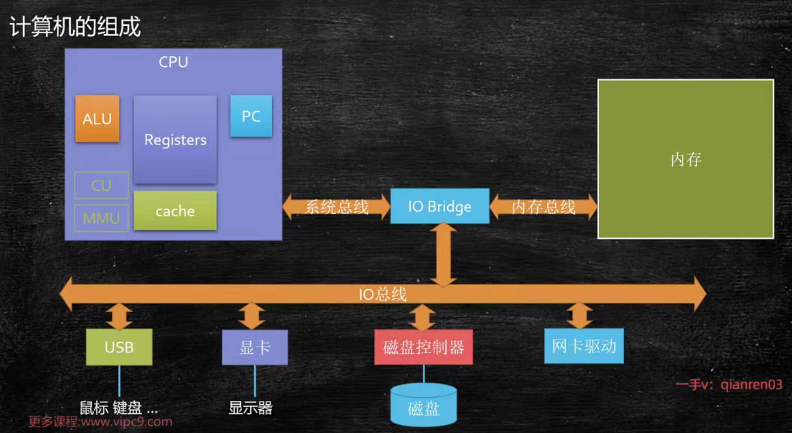

# 多线程与高并发

`https://gitee.com/caixin-wang/juc.git`

## 线程基础知识

大家都知道这个CPU这东西呢，是人民发明出来用来做计算的，那好，既然你是给我做计算的，我当然要把你的计算性能压榨到最高啊，不让你闲着

 

多进程的并行处理是操作系统诞生之后，基本上采用的一种对CPU性能的压榨的通用的手段。

我们这儿内存里面有程序abcd。那么，作为操作系统来讲，我看到a呃，现在它需要做计算，我就把a交给我们CPU去做。a在中间的时候需要等待，需要阻塞，比如说需要等的那个网络的一个输入。这时候呢，它暂时用不着CPU了，怎么办呢诶？把b切换给CPU，让b去做。哎b，等待了让c去做等等，这样呢CPU就不闲着，它速度虽然很快，但我不知道你闲着也能做到充分的利用好这个呢，叫做多进程的并行处理。在这儿就推出来一个概念，什么是进程，什么是线程。

qq程序内部其实它也有好多不同的任务，在并行执行，比如说有的任务在等待着网络的输入，有的任务呢，在刷新UI。有的任务在后台执行save操作，把我的聊天记录给我保存下来，这些个任务。他们之间要执行的时候，哎，实际上也是并行的执行的好，这个时候呢，就产生了线程这个概念。线程是属于一个进程内部的并行执行的这样的不同的路线。线程如果想提升它的效率的话呢，它内容非常的复杂，这里面呢会牵扯到，尤其是网络程序会牵扯到各种各样的，这个网络的编程模型啊和IO结合在一起。

总而言之，从单进程人工切换到多进程的批处理到多进程的并行处理，到一个程序内部不同任务的来回切换，产生了线程的概念啊。然后后面还有进一步的发展，其实那人们开始探索了所谓的绿色线程。就是原来这种多线程呢，是操作系统帮我管理的，那么绿色线程呢，也叫纤程，也叫携程啊。实际上是用户自己管理的，并不是操作系统管理的。

总而言之，线程的历史呢，就是对一部对于性能压榨的历史啊，所以有的大厂呢，他尤其写中间件的这部分人啊，他就是非常喜欢你能透彻的运用你各种各样的手段，多线程也好啊，线程也好，携程也好，你尽你最大的努力，把程序写到最棒，对CPU的利用率最高。这是一个很牛逼的技能


大厂喜欢连着问，然后展开


到底什么是一个程序？举个小小的例子，`.EXE`这就是一个很普通的WINDOWS底下可以运行的程序。OK，那我们怎么去运行它呢？我们一般来说叫做双击它，它就开始运行。背后执行了什么操作？就是操作系统找到我们这个程序的可执行文件。所谓的一个程序就是一个操作系统可以执行的文件。找到一个文件之后，把它相关的信息load到内存里。也就是说，在内存里头呢就有一个正在运行的QQ点EXE，比如说它是号码一。作为QQ点EXE来说，你可以再双击它一遍诶，它就又放进去一个QQ点EXE。这当然了，这个呢，就是号码二，当然还有号码三四如果你又打开了几个qq.exe的话。OK，所以一个程序呢，是可以在内存里头放好多份儿的，在内存里头的每一份儿都称之为一个进程。

我们操作系统会为每一个进程分配它相关的一些资源，最简单的资源比如说内存空间，当然还有其他资源比如说文件描述符，端口号等等，这些都是它相关的资源。总而言之。程序静静的躺在硬盘上，真正它开始执行的时候，才把它放到内存里。好放到内存之后，哪个程序需要执行，把它放到CPU去执行，这是程序跟进程的概念。一个程序可以有多个进程，当然它可以通过代码来控制它只有一个进程。

把程序放到内存里，变成进程之后，那么就可以给它分配相应的可执行运行的时候所需要的资源了。所以呢，作为进程来讲，它是操作系统进行资源分配的基本单位



其实通俗角度来理解的话呢？基本上一个程序里头不同的执行路径就叫做一个线程。

你会发现我们程序执行的时候一定是执行这句话开始，到if语句里头做个分支，到while语句里做个循环，但是不管你怎么样，你只有一条路径走下来，走到程序的结束。所以说如果你的程序里没有同时都在运行的路径，那就是单线程。但是这个线程呢，一般称之为主线程。我们的main方法所开启的那个线程被称之为主的线程。

那到底什么样的才叫多线程呢？线程的含义当然就是当你启动完一个程序之后，它在中间的时候会产生分支。同时，不同的分支在同时运行。这个分支在等待着程序的输入。这个分支在存数据，这个分支在等待着网络的输入。这几个分支是同一时间段里头都在运行，这个东西叫多线程。


我们怎么开始执行这个进程呢？程序是怎么开始执行的呢？真正开始执行的时候，程序是以线程为单位来执行。我们的操作系统会找到我们的主线程，主线程是谁？main方法是吧？开始的这个线程main把它给拎出来，找到没方法的第一句话扔给我们的CPU去执行。找到我们主线程中间开启了其他线程，再来线程之间的来回切换。有ab线程，a线程执行一会儿了，然后让b线程执行一会儿，这就产生了线程的切换。

进程叫做资源分配的基本单位，它是一个静态概念，它就是分配资源的。而线程是在进程的内部是。调度执行的基本单位。线程是一个动态的概念。

作为一个程序来说呢，它有指令有数据啊，程序来说有指令有数据。那么，作为CPU来说呢，它有几个重要的组成单元呃，第一个叫计算单元AVL，还有叫寄存器组用来存储数据的、PC也是一种寄存器，program counter，用来存储我到底执行到哪条指令了。t1线程要运行的时候，把t1的指令和数据放进CPU，然后CPU计算单元对它进行计算，计算好了之后该做输出做输出，该做其他操作的做其他操作。

假如说根据我们操作系统的线程调度的算法，这个线程已经到他的时间了，你该走了。我不能再继续服务你了，我该服务另外一个线程了，在这种情况下该怎么办呢？在我们就把目光集中在这个线程的切换上，现在呢，是t1的线程，它的数据在寄存器里。然后对它来进行计算，那么要换另外一个线程的时候，实际上非常的简单，就是把t1线程的数据和指令。地指令地址了，存好了，存哪去呢？放到我们的缓存cache里面去。你也可以理理解为把它放到内存里，都可以把总而言之把它放到旁边去，放到一个地方，再把另外一个线程t2。它相关的数据，它相关的指令放进来，让CPU继续来做计算。

所以CPU是一个特别傻的东西，他就管算。至于说这条指令和这个数据是属于谁的，属于哪个线程的谁的事儿。这老大操作系统的事情。线程切换当然中间需要经过操作系统的调度过程，那操作系统这个调度呢，也是需要消耗系统资源的。所以线程切换就是这么一个过程，它的专业名词呢叫？context.switch线程上下文切换。


- 单核CPU设定多线程是否有意义?

  有的，因为并不是所有的线程都需要CPU，有的线程可能在阻塞等待网络io。

线程分为cpu密集型和io密集型。

- 工作线程数是不是设置的越大越好?

  线程之间的切换也是需要消耗资源的，肯定不会越大越好。

- 工作线程数(线程池中线程数量)设多少合适?

  根据cpu的核数可以得到一个比较好的速度。但是也不是按照cpu的核数来设置就一定是最好的，因为在你自己机器上跑的东西不只有你的线程。

  下面有公式，但是这么知道W/C是多少？一般来说要根据工具来进行测算。工具一般称之为profiler，profiler对与现在这种场景的简单运用就是去分析我们当前这个程序的性能瓶颈在哪。如果已经部署到远程了，实际运行环境和我的压测的环境不一样了，这时候可以用arthas，

  

### 创建线程的五种方法

1. 继承Thread
2. 实现Runnable接口。利用代理模式，将实现了Runnable接口的类对象传进Thread的构造器中。
3. lamda表达式，本质上就是第二种
4. 线程池
5. 带返回类型的，实现了Callable接口然后由一个泛型来知道返回什么类型，然后利用线程池的submit方法来执行！submit返回的是一个Future类型。
6. 如果不用线程池，自己然后里面自己运行可以带返回值的任务。

```JAVA
public class Code01 {
    static class MyThread extends Thread {
        @Override
        public void run() {
            System.out.println("Hello MyThread!");
        }
    }

    static class MyRun implements Runnable {
        @Override
        public void run() {
            System.out.println("Hello MyRun!");
        }
    }

    static class MyCall implements Callable<String>{
        @Override
        public String call() throws Exception {
            return "6666";
        }
    }

    public static void main(String[] args) throws ExecutionException, InterruptedException {
        System.out.println("========继承=========");
        new MyThread().start();
        Thread.sleep(10);
        System.out.println("========实现Runnable接口=========");
        new Thread(new MyRun()).start();
        Thread.sleep(10);
        //lamda表达式
        System.out.println("========lamda=========");
        new Thread(()->{
            System.out.println("Hello Lambda!");
        }).start();
        Thread.sleep(10);
        //线程池
        System.out.println("=========线程池submit========");
        ExecutorService service= Executors.newCachedThreadPool();
        service.execute(()-> System.out.println("hello!"));
        Thread.sleep(10);
        //有返回值类型
        System.out.println("=========线程池有返回值类型========");
        Future<String> f = service.submit(new MyCall());
        System.out.println(f.get());
        service.shutdown();
        Thread.sleep(10);
        //FutureTask
        System.out.println("=========FutureTask========");
        FutureTask<String> futureTask=new FutureTask<>(new MyCall());
        new Thread(futureTask).start();
        System.out.println(futureTask.get());
        Thread.sleep(10);
    }
}
```

### 线程的状态

Runnable分为READY和RUNNING，READY代表可以被线程调度器选中执行了，RINNING代表已经被选中了，在执行了。`YIELD`方法就是在这两种状态之间的切换。


READY就是我可以运行了在等CPU运行我，RUNNING就是CPU正在运行我。

synchronized----正在等待某一把锁，但是我还没有竞争到这把锁，我正在抢这把锁呢，那么这时候，我是被blocked，是被阻塞的状态。

waiting的意思是我并没有进入说阻塞这种状态，不是说我进入阻塞队列，而是说我进入一个忙等待。等待锁这个过程，除了synchronized的这种状态叫blocked之外，其他的等锁的过程都叫做waiting。


```JAVA
public static void main(String[] args) throws Exception {

        Thread t1=new Thread(()->{
            System.out.println("2:"+Thread.currentThread().getState());//START了才会执行里面的代码
            System.out.println("t1 is working ...");
            SleepHelper.sleep(1);//try-catch麻烦自己写一个
        });
        System.out.println("1:"+t1.getState());
        t1.start();//将t1线程开启，start之前都是new状态，start之后要么是READY要么是RUNNING，也就是RUNNABLE
        t1.join();//等待t1线程结束
        System.out.println("3:"+t1.getState());//t1线程结束

        System.out.println("=====================================");

        Thread t2=new Thread(()->{
            LockSupport.park();//等着被别人叫醒---waiting
            System.out.println("t2 is working");
            SleepHelper.sleep(3);
        });
        t2.start();
        SleepHelper.sleep(1);
        System.out.println("4:"+t2.getState());//因为park了，所以此时是WAITING
        LockSupport.unpark(t2);//叫醒t2
        SleepHelper.sleep(1);//睡一秒确定t2已经被叫醒了
        System.out.println("5:"+t2.getState());//t2往下执行到sleep---TIMED_WAITING

        System.out.println("=====================================");

        final Object o=new Object();//资源
        Thread t3=new Thread(()->{
            synchronized (o){
                System.out.println("t3 得到了锁 o");
            }
        });

        new Thread(()->{//定义为t3之后直接启动一个线程先去把资源o抢了
            synchronized (o){
                System.out.println("另一个线程 得到了锁 o");
                SleepHelper.sleep(3);
            }
        }).start();

        SleepHelper.sleep(1);
        t3.start();//另外一线线程拿着资源要占3s，此时t3被阻塞了，BLOCKED
        SleepHelper.sleep(1);
        System.out.println("6:"+t3.getState());//此时另外一个线程还没释放资源，还是阻塞
        SleepHelper.sleep(2);//主线程睡这两秒的过程中，另外一个线程释放资源了，t3得到了资源，开始working

        System.out.println("=====================================");

        final Lock lock = new ReentrantLock();//用的JUC的锁---cas实现---是一种忙等待，不是BLOCKED
        Thread t4=new Thread(()->{
            lock.lock();//申请获得这把锁
            System.out.println("t4 得到了锁");
            System.out.println("t4 is working");
            SleepHelper.sleep(1);
            lock.unlock();//释放锁
        });

        new Thread(()->{//t4定义完成之后直接启动一个线程先去把锁抢了
            lock.lock();//申请获得这把锁
            System.out.println("另外一个线程 得到了锁");
            SleepHelper.sleep(3);//拿着锁3秒
            lock.unlock();//释放锁
        }).start();

        SleepHelper.sleep(1);//此时另外那个线程差不多还有2s才释放锁
        t4.start();//另外一个线程还有2s释放锁，所以t4还有2s左右才能开始working
        SleepHelper.sleep(1);//还1s释放锁
        System.out.println("7:"+t4.getState());//还没抢到锁，忙等
        SleepHelper.sleep(3);//睡完肯定抢到了并且工作结束了

        System.out.println("=====================================");

        Thread t5=new Thread(()->{
            LockSupport.park();//等着被叫醒
            System.out.println("t5 is working");
            SleepHelper.sleep(1);
        });
        t5.start();
        SleepHelper.sleep(1);
        System.out.println("8:"+t5.getState());//还没被叫醒---WAITING
        LockSupport.unpark(t5);//叫醒了
        SleepHelper.sleep(2);

    }
```

### 线程的“打断”

和线程打断有关的三个方法。

`thread.interrupt()`并不是直接就把这个线程打断了，而是设置这个线程的中断标志位，至于后面要怎么处理，是由这个线程自己说了算。

`thread.isInterrupted()`就是字面意思，依然有人可以设置中断标志位，我就可以查一下是否它被设置过

`Thread.interrupted()`第三个方法和第二个方法要区别开，因为第三个方法是一个静态方法，这个方法对当前线程查询是否被打断过，重置打断标志


看一下第一个方法和第二个方法

```JAVA
public static void main(String[] args) {
        Thread t=new Thread(()->{
            int i=0;
            while (true){
                if (i==0){
                    System.out.println("Thread is "+(Thread.currentThread().isInterrupted()?"":"not")+" interrupted!");
                    i++;
                }
                if (Thread.currentThread().isInterrupted()){
                    System.out.println("Thread is "+(Thread.currentThread().isInterrupted()?"":"not")+" interrupted!");
                    break;//只要有人设置过标志位了，那么就结束线程，这也是比较优雅的结束线程的方法。
                }
            }
        });
        t.start();//上来肯定还没有被设置过
        SleepHelper.sleep(2);//两秒
        t.interrupt();//打断它
    }
```

输出：

```JAVA
Thread is not interrupted!
Thread is  interrupted!
```

看第三个方法

```JAVA
public static void main(String[] args) {
        Thread t=new Thread(()->{
            int i=0;
            while (true){
                if (i==0){
                    System.out.println("Thread is "+(Thread.interrupted()?"":"not")+" interrupted!");
                    i++;
                }
                if (Thread.interrupted()){//这里if判断的时候查询的时候是true，但是进入if之后已经重新设置为false了
                    System.out.println("Thread is "+(Thread.interrupted()?"":"not")+" interrupted!");
                    break;
                }
            }
        });
        t.start();//上来肯定还没有被设置过
        SleepHelper.sleep(2);//两秒
        t.interrupt();//打断它
        System.out.println("Main:"+t.interrupted());//尽管这里是t，由于这个方法是静态的，永远都是访问的当前线程，此时也就是main
    }
```

输出：

```
Thread is not interrupted!
Thread is not interrupted!
Main:false
```

再来看看interrupt的sleep的配合使用。当你对一个线程 thread 调用sleep  wait   join  这样的方法的时候，你是可以对 thread 这样的线程设置标志位的。一旦在 thread，sleep、wait、join的时候你对它设置了标志位，那么这几个方法就会抛异常`InterrptedExcepetion`！你下一步怎么处理catch这个异常之后，你要不要catch？catch完之后怎么处理？其实主动权还是交给了线程本身。

比方说7×24小时365天不间断运行的这种服务器程序。在你服务器程序的这个循环里头如果有sleep方法（当然一般不建议有），如果有wait方法（这个这个倒是有可能），如果有什么join（也很少用），总而言之，像这种的，你要想它正确，你要想用interrupt的方法让它停止的话，你这个时候必须得catch住interrupted异常，然后对这个异常做出正确的响应。言而总之，这个灵活度是交给写程序员的，并没有一个固定的处理过程。

有同学就容易混淆，你看他都已经打断了、都已经抛异常了，它是不是就该结束了？catch了这个异常之后怎么处理是你自己的事情。

可以看到catch里面处理的时候，这个标志位是false。一旦抛出interrupted exception的异常之后，默认的情况下。JAVA会自动的帮你把那个标志位给复位。

```JAVA
public static void main(String[] args) {
        Thread t=new Thread(()->{
            try {
                Thread.sleep(2000);
            } catch (InterruptedException e) {
                System.out.println("Thread is interrupted!");
                System.out.println(Thread.currentThread().isInterrupted());
            }
        });
        t.start();
        SleepHelper.sleep(1);
        t.interrupt();
    }
```

输出：

```
Thread is interrupted!
false
```

还有就是wait，和上面类似，也是有在catch里面自己处理中断异常

```java
private static Object o=new Object();
public static void main(String[] args) {
    Thread t=new Thread(()->{
       synchronized (o){
           try {
               o.wait();
           } catch (InterruptedException e) {
               System.out.println("Thread is interrupted!");
               System.out.println(Thread.currentThread().isInterrupted());
           }
       }
    });
    t.start();
    SleepHelper.sleep(1);
    t.interrupt();
}
```

输出：

```
Thread is interrupted!
false
```

我们来聊一个很严重的小问题，就是我这个设标志位这件事儿，是不是能够把一个正在争抢锁、正在竞争锁的`synchronized`这个状态给它打断？它会不会抛异常？结论：这是不可能的。强调一遍，这个东西叫设标志位，而并不是把线程给打折腿儿。你设了个标志位，那我该抢锁还是要抢锁，它不会理会。

```JAVA
    private static Object o=new Object();
    public static void main(String[] args) {
        Thread t1=new Thread(()->{
           synchronized (o){
               System.out.println("t1 is working");
               try {
                   Thread.sleep(5000);
               } catch (InterruptedException e) {
                   System.out.println("Thread is interrupted!");
                   System.out.println(Thread.currentThread().isInterrupted());
               }
           }
        });
        t1.start();
        SleepHelper.sleep(1);//t1 remain 4s
        Thread t2=new Thread(()->{
            synchronized (o){
                System.out.println("t2 is working");
                System.out.println(Thread.currentThread().isInterrupted());
            }
        });
        t2.start();
        SleepHelper.sleep(1);//t1 remain 3s
        t2.interrupt();//不会打断抢锁的动作，但是中断位确实被设置为true了
        SleepHelper.sleep(1);//t1 remain 2s
        t1.interrupt();//t1抢到锁，是可以被中断的，中断之后立马释放资源，t2立马抢到资源开始工作
        //这里t2线程开始工作....
    }
```

输出：

```
t1 is working
Thread is interrupted!
false
t2 is working
true
```

上面讲过interrupt是不可能打断synchronized这个抢锁过程的，那interrupt能不能够打断juc里面的reentrant lock这种新新型的锁？抢锁的过程是影响不到的，也就是t2会一直在lock()那等待，你设置了标志位也是等进入到了working的过程中才会触发中断。

```java
private static ReentrantLock lock=new ReentrantLock();
public static void main(String[] args) {
    Thread t1=new Thread(()->{
        lock.lock();//抢锁
        try {
            System.out.println("t1 is working");
            Thread.sleep(5000);
        } catch (InterruptedException e) {
            System.out.println("Thread t1 is interrupted!");
            System.out.println(Thread.currentThread().isInterrupted());
        } finally {
            lock.unlock();//释放锁
        }
    });
    t1.start();
    SleepHelper.sleep(1);//t1 remain 4s
    Thread t2=new Thread(()->{
        lock.lock();
        try {
            System.out.println("t2 is working");
            Thread.sleep(200);
        } catch (InterruptedException e) {
            System.out.println("Thread t2 is interrupted!");
            System.out.println(Thread.currentThread().isInterrupted());
        } finally {
            lock.unlock();//释放锁
        }
        System.out.println("t2 is finished");
    });
    t2.start();
    SleepHelper.sleep(1);//t1 remain 3s
    t2.interrupt();//不会打断抢锁的动作，但是中断位确实被设置为true了,3s后刚一抢到里面进入异常处理了
    SleepHelper.sleep(1);//t1 remain 2s
    t1.interrupt();//t1抢到锁，是可以被中断的，中断之后立马释放资源，t2立马抢到资源开始工作，t2提前两秒
    //这里t2线程开始工作....
}
```

输出：

```
t1 is working
Thread t1 is interrupted!
false
t2 is working
Thread t2 is interrupted!
false
t2 is finished
```

如果我就想打断抢锁的过程。

```java
private static ReentrantLock lock=new ReentrantLock();
    public static void main(String[] args) {
        Thread t1=new Thread(()->{
            lock.lock();//抢锁
            try {
                System.out.println("t1 is working");
                Thread.sleep(5000);
            } catch (InterruptedException e) {
                System.out.println("Thread t1 is interrupted!");
                System.out.println(Thread.currentThread().isInterrupted());
            } finally {
                lock.unlock();//释放锁
                System.out.println("t1 is finished");
            }
        });
        t1.start();
        SleepHelper.sleep(1);//t1 remain 4s
        Thread t2=new Thread(()->{
            try {
                lock.lockInterruptibly();
                System.out.println("t2 is working");
            } catch (InterruptedException e) {
                System.out.println("Thread t2 is interrupted!");
                System.out.println(Thread.currentThread().isInterrupted());
            } finally {
//                if (lock.isLocked()) lock.unlock();//报错
            }
            System.out.println("t2 is finished");
        });
        t2.start();
        SleepHelper.sleep(1);//t1 remain 3s
        t2.interrupt();//不会打断抢锁的动作，但是中断位确实被设置为true了,3s后刚一抢到里面进入异常处理了
        SleepHelper.sleep(1);//t1 remain 2s
    }
```

输出：

```
t1 is working
Thread t2 is interrupted!
false
t2 is finished
t1 is finished
```

### 如何优雅的结束一个线程

你让一个线程自然而然运行结束，这是最优雅的方式，但是像这种方式的话，实际当中有可能是你你做不到的，因为有些线程就是一个死循环。7×24小时365天不间断运行的服务器中间出问题了，你想把服务器给中断掉，好多人都登录在上面，自己的中间的状态信息全都在这个服务器上，你不能随随便便把它给打断。所以这个时候你怎么优雅的把这个线程给它终止掉呢？还能够尽量的不丢失中间的这些状态呢？

用stop来终止已经被废弃了。stop方法非常的粗暴，就是你正在那儿跑，他二话不说，直接把你打腿儿打折，不让你往前跑了。为什么不建议呢？主要就是因为它容易产生这种数据不一致的问题。

stop方法会干一件事儿。它会比如说啊，你现在在这里的时候，你持有一把锁，或者你持有好几把锁，随便你，它会二话不说，释放所有的锁，并且不会做善后的工作。给某一把锁上锁之后，你本来是呢要完成某一种数据的一致性，你要把这个a这个数据改成3，b这个数据改成4，这两要互相配合，a和b结为夫妻。结果呢，老公给老婆设好了a=3，还没来得及设b=4的时候就被stop方法给干掉了，非常容易产生数据不一致的问题。

```JAVA
public static void main(String[] args) {
    Thread t=new Thread(()->{
       while (true){
           System.out.println("working ...");
           SleepHelper.sleep(1);
       }
    });
    t.start();
    SleepHelper.sleep(5);
    t.stop();
}
```

输出：

```
working ...
working ...
working ...
working ...
working ...
```

和stop方法一样还有两个也是被废弃的方法，一个是suspend，一个是resume。suspend是暂停的意思，resume是恢复执行的意思。

为什么这两个方法也废弃了？这个原因呢，跟stop非常的类似。你让它暂停，万一它暂停的时候正在持有一把锁，然后这个锁是不会被释放的，这锁要是不会释放的话，你什么时候让它重新启动啊？万一你忘了让它重新继续这把锁，可就永远不会被释放了。所以这俩方法也依然特别容易产生这种数据不一致的问题，或者说容易产生死锁的问题。

```java
public static void main(String[] args) {
    Thread t=new Thread(()->{
       while (true){
           System.out.println("working ...");
           SleepHelper.sleep(1);
       }
    });
    t.start();
    SleepHelper.sleep(5);//5s 之后把t暂停
    t.suspend();
    System.out.println("suspend");
    SleepHelper.sleep(3);//3s 之后让t继续
    t.resume();
    SleepHelper.sleep(3);//stop结束掉
    t.stop();
}
```

输出：

```
working ...
working ...
working ...
working ...
working ...
suspend
working ...
working ...
working ...
```

那么如何优雅的结束呢？volatile这种方式，你会发现运行两次两个数字不一样。用这种方式是可以让线程结束，但是你很难精确的控制，说我循环了多少次。所以volatile其实也算是相对优雅的一种让线程结束的方式，只要你不依赖于while循环里面的中间有状态，比如那个 i，我非得加到被二整除才能结束，不被二整除不能结束等等，只要你不依赖于这玩意儿，那么volatile还是可以起到它的作用的。

当然volatile也有它的局限性，你需要意识到这一点。它是时间上是很难控制的，不能控制时间的话，比如说，我们有一个生产者消费者的问题，然后我这个有一个能装十个元素的容器，我装到第四个的时候，我必须得停止，你用volatile让它停止这个就不太现实。因为你要用volatile让它停止的话，在判断这个volatile变量的时候，下面有可能由于时间上不固定，所以有可能在循环的过程之中，你可能已经多加了两个进去了。

还有一种情况就是，如果我在这个循环里头有wait、receive、accept等等这方面的一些操作的时候。wait的话它就会阻塞在那里，虽然你这个running设为false了，但是由于中间阻塞了之后它不能回到下一次循环，所以它也结束不了。

相对来说，只要是你不依赖于中间状态，比方说上传个文件，你说多传一点儿数据，少传一点儿数据，让它停止这个是无所谓的。所以volatile在特定的场景之下有它的作用，而且用起来比较方便。

```java
public class Code03 {//volatile
    private static volatile boolean running =true;
    public static void main(String[] args) {
        Thread t=new Thread(()->{
            long i=0L;
            while (running) {
                i++;
            }
            System.out.println("Thread t finished and i = "+i);
        });
        t.start();
        SleepHelper.sleep(1);
        running=false;
    }
}
```

输出：

```
Thread t finished and i = 3304041449     ---- 第一次
Thread t finished and i = 3388427933     ---- 第二次
```

还有另外一种方法就是使用我们的interrupt设定标志位。与此同时，在我们的业务逻辑里面，到合适的时间点，我们要检查这个标记位是不是被设置了，如果被设置了的话我就退出就可以了。

和volatile非常类似，中断标志位也是一个标志位啊。只不过中断标志位这个是线程自带的标志位，而volatile是我们自己手工设置了一个标志位。哪种更加的优雅一些呢？interrupt会更加的优雅一些。因为如果是volatile中间有一些sleep，wait，这样的方法的时候，你是让它停不了的，你不能够跳到下一次循环让它去读那个running的标志位。但是，如果是interrupt的话，你只要在sleep wait里面处理interrupted exception，其实也可以正确的结束这个线程。

当然interrupt也有它自己的一些不太合适的地方，有些场景也不合适。和volatile一样，都无法控制中间的一些状态。必须得你自己的这个业务线程--生产者线程和我们外面要执行打断生产者线程的这个线程要做配合才行。

还有一些其他的方法可以结束一个线程，但是大同小异。有一些方法，是需要你内部线程做一些定时的检查，比如说我每隔多长时间检查一个标志位。其实呢，也是标志位。每经过一次循环检查一次标志位，实际上就是现在的这个interrupted。总而言之，如果说你不依赖于中间的那种精确的次数或者精确的时间，interrupt或者volatile flag 都好使。

```java
public class Code04 {//中断标志位
    public static void main(String[] args) {
        Thread t=new Thread(()->{
            while (!Thread.interrupted()){

            }
            System.out.println("Thread t finished");
        });
        t.start();
        SleepHelper.sleep(3);
        t.interrupt();
    }
}
```

输出：

```
Thread t finished
```

当然，要想精确的控制在某个点上或者循环多少次，或者某个值到那个位置之后，我想让它停止，就必须让你的那个业务线程跟外面的你要结束它的这个线程相配合，这时候就要用到锁才能做到精确的控制


## 并发编程的三大特性

面试中的重中之重！

这三大特性分别是什么呢？第一个叫可见性visibility。第二个叫有序性，第三个叫原子性。这里面最复杂的实际上是原子性。当然，其实哪个都不太简单，牵扯到一些底层的内容。

