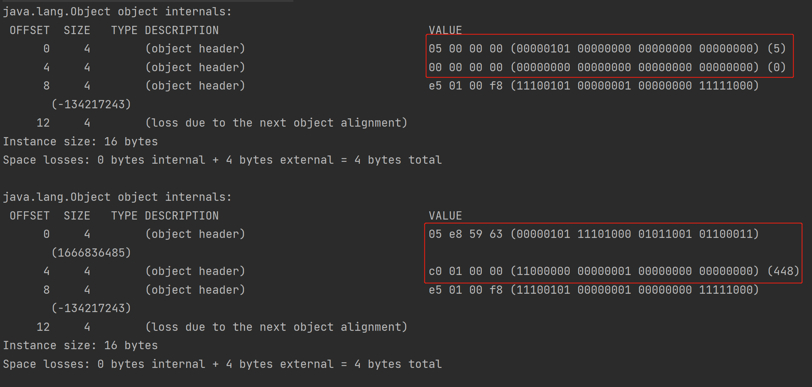

# 多线程与高并发

`https://gitee.com/caixin-wang/juc.git`

## 线程基础知识

大家都知道这个CPU这东西呢，是人民发明出来用来做计算的，那好，既然你是给我做计算的，我当然要把你的计算性能压榨到最高啊，不让你闲着

 

多进程的并行处理是操作系统诞生之后，基本上采用的一种对CPU性能的压榨的通用的手段。

我们这儿内存里面有程序abcd。那么，作为操作系统来讲，我看到a呃，现在它需要做计算，我就把a交给我们CPU去做。a在中间的时候需要等待，需要阻塞，比如说需要等的那个网络的一个输入。这时候呢，它暂时用不着CPU了，怎么办呢诶？把b切换给CPU，让b去做。哎b，等待了让c去做等等，这样呢CPU就不闲着，它速度虽然很快，但我不知道你闲着也能做到充分的利用好这个呢，叫做多进程的并行处理。在这儿就推出来一个概念，什么是进程，什么是线程。

qq程序内部其实它也有好多不同的任务，在并行执行，比如说有的任务在等待着网络的输入，有的任务呢，在刷新UI。有的任务在后台执行save操作，把我的聊天记录给我保存下来，这些个任务。他们之间要执行的时候，哎，实际上也是并行的执行的好，这个时候呢，就产生了线程这个概念。线程是属于一个进程内部的并行执行的这样的不同的路线。线程如果想提升它的效率的话呢，它内容非常的复杂，这里面呢会牵扯到，尤其是网络程序会牵扯到各种各样的，这个网络的编程模型啊和IO结合在一起。

总而言之，从单进程人工切换到多进程的批处理到多进程的并行处理，到一个程序内部不同任务的来回切换，产生了线程的概念啊。然后后面还有进一步的发展，其实那人们开始探索了所谓的绿色线程。就是原来这种多线程呢，是操作系统帮我管理的，那么绿色线程呢，也叫纤程，也叫携程啊。实际上是用户自己管理的，并不是操作系统管理的。

总而言之，线程的历史呢，就是对一部对于性能压榨的历史啊，所以有的大厂呢，他尤其写中间件的这部分人啊，他就是非常喜欢你能透彻的运用你各种各样的手段，多线程也好啊，线程也好，携程也好，你尽你最大的努力，把程序写到最棒，对CPU的利用率最高。这是一个很牛逼的技能


大厂喜欢连着问，然后展开


到底什么是一个程序？举个小小的例子，`.EXE`这就是一个很普通的WINDOWS底下可以运行的程序。OK，那我们怎么去运行它呢？我们一般来说叫做双击它，它就开始运行。背后执行了什么操作？就是操作系统找到我们这个程序的可执行文件。所谓的一个程序就是一个操作系统可以执行的文件。找到一个文件之后，把它相关的信息load到内存里。也就是说，在内存里头呢就有一个正在运行的QQ点EXE，比如说它是号码一。作为QQ点EXE来说，你可以再双击它一遍诶，它就又放进去一个QQ点EXE。这当然了，这个呢，就是号码二，当然还有号码三四如果你又打开了几个qq.exe的话。OK，所以一个程序呢，是可以在内存里头放好多份儿的，在内存里头的每一份儿都称之为一个进程。

我们操作系统会为每一个进程分配它相关的一些资源，最简单的资源比如说内存空间，当然还有其他资源比如说文件描述符，端口号等等，这些都是它相关的资源。总而言之。程序静静的躺在硬盘上，真正它开始执行的时候，才把它放到内存里。好放到内存之后，哪个程序需要执行，把它放到CPU去执行，这是程序跟进程的概念。一个程序可以有多个进程，当然它可以通过代码来控制它只有一个进程。

把程序放到内存里，变成进程之后，那么就可以给它分配相应的可执行运行的时候所需要的资源了。所以呢，作为进程来讲，它是操作系统进行资源分配的基本单位


其实通俗角度来理解的话呢？基本上一个程序里头不同的执行路径就叫做一个线程。

你会发现我们程序执行的时候一定是执行这句话开始，到if语句里头做个分支，到while语句里做个循环，但是不管你怎么样，你只有一条路径走下来，走到程序的结束。所以说如果你的程序里没有同时都在运行的路径，那就是单线程。但是这个线程呢，一般称之为主线程。我们的main方法所开启的那个线程被称之为主的线程。

那到底什么样的才叫多线程呢？线程的含义当然就是当你启动完一个程序之后，它在中间的时候会产生分支。同时，不同的分支在同时运行。这个分支在等待着程序的输入。这个分支在存数据，这个分支在等待着网络的输入。这几个分支是同一时间段里头都在运行，这个东西叫多线程。


我们怎么开始执行这个进程呢？程序是怎么开始执行的呢？真正开始执行的时候，程序是以线程为单位来执行。我们的操作系统会找到我们的主线程，主线程是谁？main方法是吧？开始的这个线程main把它给拎出来，找到没方法的第一句话扔给我们的CPU去执行。找到我们主线程中间开启了其他线程，再来线程之间的来回切换。有ab线程，a线程执行一会儿了，然后让b线程执行一会儿，这就产生了线程的切换。

进程叫做资源分配的基本单位，它是一个静态概念，它就是分配资源的。而线程是在进程的内部是。调度执行的基本单位。线程是一个动态的概念。

作为一个程序来说呢，它有指令有数据啊，程序来说有指令有数据。那么，作为CPU来说呢，它有几个重要的组成单元呃，第一个叫计算单元AVL，还有叫寄存器组用来存储数据的、PC也是一种寄存器，program counter，用来存储我到底执行到哪条指令了。t1线程要运行的时候，把t1的指令和数据放进CPU，然后CPU计算单元对它进行计算，计算好了之后该做输出做输出，该做其他操作的做其他操作。

假如说根据我们操作系统的线程调度的算法，这个线程已经到他的时间了，你该走了。我不能再继续服务你了，我该服务另外一个线程了，在这种情况下该怎么办呢？在我们就把目光集中在这个线程的切换上，现在呢，是t1的线程，它的数据在寄存器里。然后对它来进行计算，那么要换另外一个线程的时候，实际上非常的简单，就是把t1线程的数据和指令。地指令地址了，存好了，存哪去呢？放到我们的缓存cache里面去。你也可以理理解为把它放到内存里，都可以把总而言之把它放到旁边去，放到一个地方，再把另外一个线程t2。它相关的数据，它相关的指令放进来，让CPU继续来做计算。

所以CPU是一个特别傻的东西，他就管算。至于说这条指令和这个数据是属于谁的，属于哪个线程的谁的事儿。这老大操作系统的事情。线程切换当然中间需要经过操作系统的调度过程，那操作系统这个调度呢，也是需要消耗系统资源的。所以线程切换就是这么一个过程，它的专业名词呢叫？context.switch线程上下文切换。


- 单核CPU设定多线程是否有意义?

  有的，因为并不是所有的线程都需要CPU，有的线程可能在阻塞等待网络io。

线程分为cpu密集型和io密集型。

- 工作线程数是不是设置的越大越好?

  线程之间的切换也是需要消耗资源的，肯定不会越大越好。

- 工作线程数(线程池中线程数量)设多少合适?

  根据cpu的核数可以得到一个比较好的速度。但是也不是按照cpu的核数来设置就一定是最好的，因为在你自己机器上跑的东西不只有你的线程。

  下面有公式，但是这么知道W/C是多少？一般来说要根据工具来进行测算。工具一般称之为profiler，profiler对与现在这种场景的简单运用就是去分析我们当前这个程序的性能瓶颈在哪。如果已经部署到远程了，实际运行环境和我的压测的环境不一样了，这时候可以用arthas，

  

### 创建线程的五种方法

1. 继承Thread
2. 实现Runnable接口。利用代理模式，将实现了Runnable接口的类对象传进Thread的构造器中。
3. lamda表达式，本质上就是第二种
4. 线程池
5. 带返回类型的，实现了Callable接口然后由一个泛型来知道返回什么类型，然后利用线程池的submit方法来执行！submit返回的是一个Future类型。
6. 如果不用线程池，自己然后里面自己运行可以带返回值的任务。

```JAVA
public class Code01 {
    static class MyThread extends Thread {
        @Override
        public void run() {
            System.out.println("Hello MyThread!");
        }
    }

    static class MyRun implements Runnable {
        @Override
        public void run() {
            System.out.println("Hello MyRun!");
        }
    }

    static class MyCall implements Callable<String>{
        @Override
        public String call() throws Exception {
            return "6666";
        }
    }

    public static void main(String[] args) throws ExecutionException, InterruptedException {
        System.out.println("========继承=========");
        new MyThread().start();
        Thread.sleep(10);
        System.out.println("========实现Runnable接口=========");
        new Thread(new MyRun()).start();
        Thread.sleep(10);
        //lamda表达式
        System.out.println("========lamda=========");
        new Thread(()->{
            System.out.println("Hello Lambda!");
        }).start();
        Thread.sleep(10);
        //线程池
        System.out.println("=========线程池submit========");
        ExecutorService service= Executors.newCachedThreadPool();
        service.execute(()-> System.out.println("hello!"));
        Thread.sleep(10);
        //有返回值类型
        System.out.println("=========线程池有返回值类型========");
        Future<String> f = service.submit(new MyCall());
        System.out.println(f.get());
        service.shutdown();
        Thread.sleep(10);
        //FutureTask
        System.out.println("=========FutureTask========");
        FutureTask<String> futureTask=new FutureTask<>(new MyCall());
        new Thread(futureTask).start();
        System.out.println(futureTask.get());
        Thread.sleep(10);
    }
}
```

### 线程的状态

Runnable分为READY和RUNNING，READY代表可以被线程调度器选中执行了，RINNING代表已经被选中了，在执行了。`YIELD`方法就是在这两种状态之间的切换。


READY就是我可以运行了在等CPU运行我，RUNNING就是CPU正在运行我。

synchronized----正在等待某一把锁，但是我还没有竞争到这把锁，我正在抢这把锁呢，那么这时候，我是被blocked，是被阻塞的状态。

waiting的意思是我并没有进入说阻塞这种状态，不是说我进入阻塞队列，而是说我进入一个忙等待。等待锁这个过程，除了synchronized的这种状态叫blocked之外，其他的等锁的过程都叫做waiting。


```JAVA
public static void main(String[] args) throws Exception {

        Thread t1=new Thread(()->{
            System.out.println("2:"+Thread.currentThread().getState());//START了才会执行里面的代码
            System.out.println("t1 is working ...");
            SleepHelper.sleep(1);//try-catch麻烦自己写一个
        });
        System.out.println("1:"+t1.getState());
        t1.start();//将t1线程开启，start之前都是new状态，start之后要么是READY要么是RUNNING，也就是RUNNABLE
        t1.join();//等待t1线程结束
        System.out.println("3:"+t1.getState());//t1线程结束

        System.out.println("=====================================");

        Thread t2=new Thread(()->{
            LockSupport.park();//等着被别人叫醒---waiting
            System.out.println("t2 is working");
            SleepHelper.sleep(3);
        });
        t2.start();
        SleepHelper.sleep(1);
        System.out.println("4:"+t2.getState());//因为park了，所以此时是WAITING
        LockSupport.unpark(t2);//叫醒t2
        SleepHelper.sleep(1);//睡一秒确定t2已经被叫醒了
        System.out.println("5:"+t2.getState());//t2往下执行到sleep---TIMED_WAITING

        System.out.println("=====================================");

        final Object o=new Object();//资源
        Thread t3=new Thread(()->{
            synchronized (o){
                System.out.println("t3 得到了锁 o");
            }
        });

        new Thread(()->{//定义为t3之后直接启动一个线程先去把资源o抢了
            synchronized (o){
                System.out.println("另一个线程 得到了锁 o");
                SleepHelper.sleep(3);
            }
        }).start();

        SleepHelper.sleep(1);
        t3.start();//另外一线线程拿着资源要占3s，此时t3被阻塞了，BLOCKED
        SleepHelper.sleep(1);
        System.out.println("6:"+t3.getState());//此时另外一个线程还没释放资源，还是阻塞
        SleepHelper.sleep(2);//主线程睡这两秒的过程中，另外一个线程释放资源了，t3得到了资源，开始working

        System.out.println("=====================================");

        final Lock lock = new ReentrantLock();//用的JUC的锁---cas实现---是一种忙等待，不是BLOCKED
        Thread t4=new Thread(()->{
            lock.lock();//申请获得这把锁
            System.out.println("t4 得到了锁");
            System.out.println("t4 is working");
            SleepHelper.sleep(1);
            lock.unlock();//释放锁
        });

        new Thread(()->{//t4定义完成之后直接启动一个线程先去把锁抢了
            lock.lock();//申请获得这把锁
            System.out.println("另外一个线程 得到了锁");
            SleepHelper.sleep(3);//拿着锁3秒
            lock.unlock();//释放锁
        }).start();

        SleepHelper.sleep(1);//此时另外那个线程差不多还有2s才释放锁
        t4.start();//另外一个线程还有2s释放锁，所以t4还有2s左右才能开始working
        SleepHelper.sleep(1);//还1s释放锁
        System.out.println("7:"+t4.getState());//还没抢到锁，忙等
        SleepHelper.sleep(3);//睡完肯定抢到了并且工作结束了

        System.out.println("=====================================");

        Thread t5=new Thread(()->{
            LockSupport.park();//等着被叫醒
            System.out.println("t5 is working");
            SleepHelper.sleep(1);
        });
        t5.start();
        SleepHelper.sleep(1);
        System.out.println("8:"+t5.getState());//还没被叫醒---WAITING
        LockSupport.unpark(t5);//叫醒了
        SleepHelper.sleep(2);

    }
```

### 线程的“打断”

和线程打断有关的三个方法。

`thread.interrupt()`并不是直接就把这个线程打断了，而是设置这个线程的中断标志位，至于后面要怎么处理，是由这个线程自己说了算。

`thread.isInterrupted()`就是字面意思，依然有人可以设置中断标志位，我就可以查一下是否它被设置过

`Thread.interrupted()`第三个方法和第二个方法要区别开，因为第三个方法是一个静态方法，这个方法对当前线程查询是否被打断过，重置打断标志


看一下第一个方法和第二个方法

```JAVA
public static void main(String[] args) {
        Thread t=new Thread(()->{
            int i=0;
            while (true){
                if (i==0){
                    System.out.println("Thread is "+(Thread.currentThread().isInterrupted()?"":"not")+" interrupted!");
                    i++;
                }
                if (Thread.currentThread().isInterrupted()){
                    System.out.println("Thread is "+(Thread.currentThread().isInterrupted()?"":"not")+" interrupted!");
                    break;//只要有人设置过标志位了，那么就结束线程，这也是比较优雅的结束线程的方法。
                }
            }
        });
        t.start();//上来肯定还没有被设置过
        SleepHelper.sleep(2);//两秒
        t.interrupt();//打断它
    }
```

输出：

```JAVA
Thread is not interrupted!
Thread is  interrupted!
```

看第三个方法

```JAVA
public static void main(String[] args) {
        Thread t=new Thread(()->{
            int i=0;
            while (true){
                if (i==0){
                    System.out.println("Thread is "+(Thread.interrupted()?"":"not")+" interrupted!");
                    i++;
                }
                if (Thread.interrupted()){//这里if判断的时候查询的时候是true，但是进入if之后已经重新设置为false了
                    System.out.println("Thread is "+(Thread.interrupted()?"":"not")+" interrupted!");
                    break;
                }
            }
        });
        t.start();//上来肯定还没有被设置过
        SleepHelper.sleep(2);//两秒
        t.interrupt();//打断它
        System.out.println("Main:"+t.interrupted());//尽管这里是t，由于这个方法是静态的，永远都是访问的当前线程，此时也就是main
    }
```

输出：

```
Thread is not interrupted!
Thread is not interrupted!
Main:false
```

再来看看interrupt的sleep的配合使用。当你对一个线程 thread 调用sleep  wait   join  这样的方法的时候，你是可以对 thread 这样的线程设置标志位的。一旦在 thread，sleep、wait、join的时候你对它设置了标志位，那么这几个方法就会抛异常`InterrptedExcepetion`！你下一步怎么处理catch这个异常之后，你要不要catch？catch完之后怎么处理？其实主动权还是交给了线程本身。

比方说7×24小时365天不间断运行的这种服务器程序。在你服务器程序的这个循环里头如果有sleep方法（当然一般不建议有），如果有wait方法（这个这个倒是有可能），如果有什么join（也很少用），总而言之，像这种的，你要想它正确，你要想用interrupt的方法让它停止的话，你这个时候必须得catch住interrupted异常，然后对这个异常做出正确的响应。言而总之，这个灵活度是交给写程序员的，并没有一个固定的处理过程。

有同学就容易混淆，你看他都已经打断了、都已经抛异常了，它是不是就该结束了？catch了这个异常之后怎么处理是你自己的事情。

可以看到catch里面处理的时候，这个标志位是false。一旦抛出interrupted exception的异常之后，默认的情况下。JAVA会自动的帮你把那个标志位给复位。

```JAVA
public static void main(String[] args) {
        Thread t=new Thread(()->{
            try {
                Thread.sleep(2000);
            } catch (InterruptedException e) {
                System.out.println("Thread is interrupted!");
                System.out.println(Thread.currentThread().isInterrupted());
            }
        });
        t.start();
        SleepHelper.sleep(1);
        t.interrupt();
    }
```

输出：

```
Thread is interrupted!
false
```

还有就是wait，和上面类似，也是有在catch里面自己处理中断异常

```java
private static Object o=new Object();
public static void main(String[] args) {
    Thread t=new Thread(()->{
       synchronized (o){
           try {
               o.wait();
           } catch (InterruptedException e) {
               System.out.println("Thread is interrupted!");
               System.out.println(Thread.currentThread().isInterrupted());
           }
       }
    });
    t.start();
    SleepHelper.sleep(1);
    t.interrupt();
}
```

输出：

```
Thread is interrupted!
false
```

我们来聊一个很严重的小问题，就是我这个设标志位这件事儿，是不是能够把一个正在争抢锁、正在竞争锁的`synchronized`这个状态给它打断？它会不会抛异常？结论：这是不可能的。强调一遍，这个东西叫设标志位，而并不是把线程给打折腿儿。你设了个标志位，那我该抢锁还是要抢锁，它不会理会。

```JAVA
    private static Object o=new Object();
    public static void main(String[] args) {
        Thread t1=new Thread(()->{
           synchronized (o){
               System.out.println("t1 is working");
               try {
                   Thread.sleep(5000);
               } catch (InterruptedException e) {
                   System.out.println("Thread is interrupted!");
                   System.out.println(Thread.currentThread().isInterrupted());
               }
           }
        });
        t1.start();
        SleepHelper.sleep(1);//t1 remain 4s
        Thread t2=new Thread(()->{
            synchronized (o){
                System.out.println("t2 is working");
                System.out.println(Thread.currentThread().isInterrupted());
            }
        });
        t2.start();
        SleepHelper.sleep(1);//t1 remain 3s
        t2.interrupt();//不会打断抢锁的动作，但是中断位确实被设置为true了
        SleepHelper.sleep(1);//t1 remain 2s
        t1.interrupt();//t1抢到锁，是可以被中断的，中断之后立马释放资源，t2立马抢到资源开始工作
        //这里t2线程开始工作....
    }
```

输出：

```
t1 is working
Thread is interrupted!
false
t2 is working
true
```

上面讲过interrupt是不可能打断synchronized这个抢锁过程的，那interrupt能不能够打断juc里面的reentrant lock这种新新型的锁？抢锁的过程是影响不到的，也就是t2会一直在lock()那等待，你设置了标志位也是等进入到了working的过程中才会触发中断。

```java
private static ReentrantLock lock=new ReentrantLock();
public static void main(String[] args) {
    Thread t1=new Thread(()->{
        lock.lock();//抢锁
        try {
            System.out.println("t1 is working");
            Thread.sleep(5000);
        } catch (InterruptedException e) {
            System.out.println("Thread t1 is interrupted!");
            System.out.println(Thread.currentThread().isInterrupted());
        } finally {
            lock.unlock();//释放锁
        }
    });
    t1.start();
    SleepHelper.sleep(1);//t1 remain 4s
    Thread t2=new Thread(()->{
        lock.lock();
        try {
            System.out.println("t2 is working");
            Thread.sleep(200);
        } catch (InterruptedException e) {
            System.out.println("Thread t2 is interrupted!");
            System.out.println(Thread.currentThread().isInterrupted());
        } finally {
            lock.unlock();//释放锁
        }
        System.out.println("t2 is finished");
    });
    t2.start();
    SleepHelper.sleep(1);//t1 remain 3s
    t2.interrupt();//不会打断抢锁的动作，但是中断位确实被设置为true了,3s后刚一抢到里面进入异常处理了
    SleepHelper.sleep(1);//t1 remain 2s
    t1.interrupt();//t1抢到锁，是可以被中断的，中断之后立马释放资源，t2立马抢到资源开始工作，t2提前两秒
    //这里t2线程开始工作....
}
```

输出：

```
t1 is working
Thread t1 is interrupted!
false
t2 is working
Thread t2 is interrupted!
false
t2 is finished
```

如果我就想打断抢锁的过程。

```java
private static ReentrantLock lock=new ReentrantLock();
    public static void main(String[] args) {
        Thread t1=new Thread(()->{
            lock.lock();//抢锁
            try {
                System.out.println("t1 is working");
                Thread.sleep(5000);
            } catch (InterruptedException e) {
                System.out.println("Thread t1 is interrupted!");
                System.out.println(Thread.currentThread().isInterrupted());
            } finally {
                lock.unlock();//释放锁
                System.out.println("t1 is finished");
            }
        });
        t1.start();
        SleepHelper.sleep(1);//t1 remain 4s
        Thread t2=new Thread(()->{
            try {
                lock.lockInterruptibly();
                System.out.println("t2 is working");
            } catch (InterruptedException e) {
                System.out.println("Thread t2 is interrupted!");
                System.out.println(Thread.currentThread().isInterrupted());
            } finally {
//                if (lock.isLocked()) lock.unlock();//报错
            }
            System.out.println("t2 is finished");
        });
        t2.start();
        SleepHelper.sleep(1);//t1 remain 3s
        t2.interrupt();//不会打断抢锁的动作，但是中断位确实被设置为true了,3s后刚一抢到里面进入异常处理了
        SleepHelper.sleep(1);//t1 remain 2s
    }
```

输出：

```
t1 is working
Thread t2 is interrupted!
false
t2 is finished
t1 is finished
```

### 如何优雅的结束一个线程

你让一个线程自然而然运行结束，这是最优雅的方式，但是像这种方式的话，实际当中有可能是你你做不到的，因为有些线程就是一个死循环。7×24小时365天不间断运行的服务器中间出问题了，你想把服务器给中断掉，好多人都登录在上面，自己的中间的状态信息全都在这个服务器上，你不能随随便便把它给打断。所以这个时候你怎么优雅的把这个线程给它终止掉呢？还能够尽量的不丢失中间的这些状态呢？

用stop来终止已经被废弃了。stop方法非常的粗暴，就是你正在那儿跑，他二话不说，直接把你打腿儿打折，不让你往前跑了。为什么不建议呢？主要就是因为它容易产生这种数据不一致的问题。

stop方法会干一件事儿。它会比如说啊，你现在在这里的时候，你持有一把锁，或者你持有好几把锁，随便你，它会二话不说，释放所有的锁，并且不会做善后的工作。给某一把锁上锁之后，你本来是呢要完成某一种数据的一致性，你要把这个a这个数据改成3，b这个数据改成4，这两要互相配合，a和b结为夫妻。结果呢，老公给老婆设好了a=3，还没来得及设b=4的时候就被stop方法给干掉了，非常容易产生数据不一致的问题。

```JAVA
public static void main(String[] args) {
    Thread t=new Thread(()->{
       while (true){
           System.out.println("working ...");
           SleepHelper.sleep(1);
       }
    });
    t.start();
    SleepHelper.sleep(5);
    t.stop();
}
```

输出：

```
working ...
working ...
working ...
working ...
working ...
```

和stop方法一样还有两个也是被废弃的方法，一个是suspend，一个是resume。suspend是暂停的意思，resume是恢复执行的意思。

为什么这两个方法也废弃了？这个原因呢，跟stop非常的类似。你让它暂停，万一它暂停的时候正在持有一把锁，然后这个锁是不会被释放的，这锁要是不会释放的话，你什么时候让它重新启动啊？万一你忘了让它重新继续这把锁，可就永远不会被释放了。所以这俩方法也依然特别容易产生这种数据不一致的问题，或者说容易产生死锁的问题。

```java
public static void main(String[] args) {
    Thread t=new Thread(()->{
       while (true){
           System.out.println("working ...");
           SleepHelper.sleep(1);
       }
    });
    t.start();
    SleepHelper.sleep(5);//5s 之后把t暂停
    t.suspend();
    System.out.println("suspend");
    SleepHelper.sleep(3);//3s 之后让t继续
    t.resume();
    SleepHelper.sleep(3);//stop结束掉
    t.stop();
}
```

输出：

```
working ...
working ...
working ...
working ...
working ...
suspend
working ...
working ...
working ...
```

那么如何优雅的结束呢？volatile这种方式，你会发现运行两次两个数字不一样。用这种方式是可以让线程结束，但是你很难精确的控制，说我循环了多少次。所以volatile其实也算是相对优雅的一种让线程结束的方式，只要你不依赖于while循环里面的中间有状态，比如那个 i，我非得加到被二整除才能结束，不被二整除不能结束等等，只要你不依赖于这玩意儿，那么volatile还是可以起到它的作用的。

当然volatile也有它的局限性，你需要意识到这一点。它是时间上是很难控制的，不能控制时间的话，比如说，我们有一个生产者消费者的问题，然后我这个有一个能装十个元素的容器，我装到第四个的时候，我必须得停止，你用volatile让它停止这个就不太现实。因为你要用volatile让它停止的话，在判断这个volatile变量的时候，下面有可能由于时间上不固定，所以有可能在循环的过程之中，你可能已经多加了两个进去了。

还有一种情况就是，如果我在这个循环里头有wait、receive、accept等等这方面的一些操作的时候。wait的话它就会阻塞在那里，虽然你这个running设为false了，但是由于中间阻塞了之后它不能回到下一次循环，所以它也结束不了。

相对来说，只要是你不依赖于中间状态，比方说上传个文件，你说多传一点儿数据，少传一点儿数据，让它停止这个是无所谓的。所以volatile在特定的场景之下有它的作用，而且用起来比较方便。

```java
public class Code03 {//volatile
    private static volatile boolean running =true;
    public static void main(String[] args) {
        Thread t=new Thread(()->{
            long i=0L;
            while (running) {
                i++;
            }
            System.out.println("Thread t finished and i = "+i);
        });
        t.start();
        SleepHelper.sleep(1);
        running=false;
    }
}
```

输出：

```
Thread t finished and i = 3304041449     ---- 第一次
Thread t finished and i = 3388427933     ---- 第二次
```

还有另外一种方法就是使用我们的interrupt设定标志位。与此同时，在我们的业务逻辑里面，到合适的时间点，我们要检查这个标记位是不是被设置了，如果被设置了的话我就退出就可以了。

和volatile非常类似，中断标志位也是一个标志位啊。只不过中断标志位这个是线程自带的标志位，而volatile是我们自己手工设置了一个标志位。哪种更加的优雅一些呢？interrupt会更加的优雅一些。因为如果是volatile中间有一些sleep，wait，这样的方法的时候，你是让它停不了的，你不能够跳到下一次循环让它去读那个running的标志位。但是，如果是interrupt的话，你只要在sleep wait里面处理interrupted exception，其实也可以正确的结束这个线程。

当然interrupt也有它自己的一些不太合适的地方，有些场景也不合适。和volatile一样，都无法控制中间的一些状态。必须得你自己的这个业务线程--生产者线程和我们外面要执行打断生产者线程的这个线程要做配合才行。

还有一些其他的方法可以结束一个线程，但是大同小异。有一些方法，是需要你内部线程做一些定时的检查，比如说我每隔多长时间检查一个标志位。其实呢，也是标志位。每经过一次循环检查一次标志位，实际上就是现在的这个interrupted。总而言之，如果说你不依赖于中间的那种精确的次数或者精确的时间，interrupt或者volatile flag 都好使。

```java
public class Code04 {//中断标志位
    public static void main(String[] args) {
        Thread t=new Thread(()->{
            while (!Thread.interrupted()){

            }
            System.out.println("Thread t finished");
        });
        t.start();
        SleepHelper.sleep(3);
        t.interrupt();
    }
}
```

输出：

```
Thread t finished
```

当然，要想精确的控制在某个点上或者循环多少次，或者某个值到那个位置之后，我想让它停止，就必须让你的那个业务线程跟外面的你要结束它的这个线程相配合，这时候就要用到锁才能做到精确的控制


## 并发编程的三大特性

面试中的重中之重！

这三大特性分别是什么呢？第一个叫可见性visibility。第二个叫有序性，第三个叫原子性。这里面最复杂的实际上是原子性。当然，其实哪个都不太简单，牵扯到一些底层的内容。

### 可见性

运行下面代码。理想的执行状态呢是最开始的时候呢running为true，执行m方法打印m start，在while里面运行了大概一秒钟以后，running设为false，应该是打印m finished的。

但是运行了之后发现没有打印m finished。这里头就牵扯到了线程的可见性问题。

```JAVA
public class Code01 {//可见性
    private static boolean running=true;
//    private static volatile boolean running=true;
    private static void m(){
        System.out.println("m start");
        while (running){

        }
        System.out.println("m finished");
    }

    public static void main(String[] args) {
        new Thread(Code01::m,"t1").start();
        SleepHelper.sleep(1);
        running=false;
    }
}
```

输出：只有一行m start

```
m start
```

running一定是位于我们的主内存里面，然后有两个线程都会用到这个running。第一个线程t1会用到这个running，他会去读这个running，读的是实际上是它的拷贝。说每个线程在运行的时候都会把这个数据从内存里面读出一份儿来，放在线程本地。线程本地这里指的是线程的缓存，而不是ThreadLocal。缓存这个值，它不会主动的去内存里面重新再读一遍，while循环里面一直是true。

另外一个线程是我们的主线程，main线程，在main线程里面隔了一秒钟之后，它把它自己本地缓存的这个running改成了false，改的是拷贝，和我的第一个线程一点关系都没有。

一个线程修改值之后，另外一个线程是不是能见到最新被修改的值，这就是线程的可见性。默认的情况下呢，一个线程改了之后呢，另外一个线程是看不见的


如何让线程之间相互看得见修改的值？只需要加上一个`volatile`修饰符。

```GPT
在Java中，volatile是一种轻量级的同步机制，用于保证变量的可见性和禁止指令重排。当一个变量被声明为volatile后，对它的写入操作会立即刷新到主内存中，而读取操作也会从主内存中读取最新的值。

底层实现方面，volatile的实现依赖于JVM的内存模型和硬件架构。JVM会根据硬件架构的特点来生成适当的机器指令，以实现volatile的语义。

在x86架构的处理器上，volatile变量的读写操作会通过使用lock前缀指令来实现。这个指令会将变量的修改立即刷新到主内存中，以保证变量的可见性。同时，它也会禁止处理器对指令进行重排，以保证指令的执行顺序与代码的顺序一致。

需要注意的是，volatile并不保证原子性，也就是说，如果对一个volatile变量进行复合操作（例如i++），则它仍然可能出现线程安全问题。如果需要保证原子性，可以使用java.util.concurrent.atomic包中提供的原子类。

总的来说，volatile的底层实现涉及到JVM和硬件架构，是非常复杂的。因此，在使用volatile时，我们不需要了解具体的实现细节，只需要知道它提供了一种简单、轻量级的同步机制，能够保证变量的可见性和禁止指令重排即可。
```

volatile的第一个作用，叫保持线程的可见性。volatile在这里是起的什么作用呢？就是volatile所修饰的这块儿内存，对于他的任何的修改。另外一个线程立马可见可见，可见的意思是说，对volatile修饰的这块内存，我每次去读的话都从主内存里读一遍。while循环每次都要用到这个值，那么每次我都去主内存里读一遍。

```JAVA
public class Code02 {//可见性
//    private static boolean running=true;
    private static volatile boolean running=true;
    private static void m(){
        System.out.println("m start");
        while (running){

        }
        System.out.println("m finished");
    }

    public static void main(String[] args) {
        new Thread(Code02::m,"t1").start();
        SleepHelper.sleep(1);
        running=false;
    }
}
```

输出：这时候就输出了finish了

```
m start
m finished
```

我们在while里面放了一个println，发现运行之后没有加volatile也成功停止运行了，也就是在运行的时候线程之间保持了可见性机制了。因为这个里面呢，触发了这个可见性机制。

因为prinln函数里面有一个synchronized，synchronized也是可以保持可见性的。在某些语句执行的情况下，它是可以触发本地的缓存和我们主内存之间的数据，进行一个刷新和同步。

那我以后在每个里面都加一个println行不行？别这样，你每加一个println不就上了把锁，相当于那你效率不就变低了。所以我们该用volatile还是要用volatile。

```JAVA
public class Code03 {//可见性
    private static  boolean running=true;
    private static void m(){
        System.out.println("m start");
        while (running){
            System.out.println("hello!");
        }
        System.out.println("m finished");
    }

    public static void main(String[] args) {
        new Thread(Code03::m,"t1").start();
        SleepHelper.sleep(1);
        running=false;
    }
}
```

输出：

```
hello!
hello!
hello!
hello!
m finished
```

volatile 修饰引用类型只能保证引用本身的可见性，不能保证内部字段的可见性。并不会停止，因为内存中有一个对象r，在线程t和线程main中都有自己的拷贝，只有a这个引用是可见的。所以在main中把自己拷贝的那个r对象改成了false不会影响t线程。

在下面代码中，a对象被声明为volatile，因此对它的修改会立即刷新到主内存中，保证了变量的可见性。但是，对于A类中的running变量，并没有使用volatile或者其他的同步手段，因此，在主线程中修改running变量的值并不能保证在新线程中立即可见。

具体来说，当线程t1启动时，它将running变量的值读入到自己的工作内存中。在此后的循环中，t1只会使用自己工作内存中的running变量，不会重新从主内存中读取该变量的值。因此，即使主线程将running变量的值修改为false，t1也可能不会立即发现这个变化，导致t1无法及时停止循环。

为了解决这个问题，我们需要使用同步手段，如synchronized或者volatile，来保证running变量的可见性。如果我们将A类中的running变量声明为volatile，那么当主线程将running变量的值修改为false时，这个变化会立即刷新到主内存中，从而让t1线程立即看到这个变化。

你想让它可见就在running的前面加volatile ，不要在引用类型前面加。

即使在后面你`a=new A(false);`也无法退出循环。在主线程中将a变量设置为新的A对象之后，t1线程仍然在执行旧的A对象的m方法，因此它读取的仍然是旧的A对象的running变量的值。因此，即使主线程将新的A对象的running变量设置为false，t1线程仍然在执行旧的A对象的m方法，从而导致循环无法及时退出。

```JAVA
    private static class A{
        boolean running;
        void m(){
            while (running){
            }
        }

        public A(boolean running) {
            this.running = running;
        }
    }

    private static volatile A a=new A(true);
    public static void main(String[] args) {
        new Thread(a::m,"t1").start();
        SleepHelper.sleep(1);
        System.out.println("过了1s");
        a.running=false;
    }
```

输出：无法退出

缓存的速度很快。


我们平时所说的线程的这个缓存啊，可见性来说，其实指的是这些缓存L1、L2、L3，并不是ThreadLocal。

为了让效率更高，然后我们读东西的时候，往往是按照一块儿一块儿的读，而不是你要一个int我就只读一个int，它是一读就读一个block。原理是程序的局部性原理，相邻的东西更容易读到，这是空间局部性原理。时间局部性原理就是如果一个信息项正在被访问，那么在近期它很可能还会被再次访问。

这一块数据到底有多大呢？叫做一个缓存行。专业名词叫catch line。


在我们内存里面的任何的数据的组织都是按照一行一行来组织，或者叫一块一块来组织。这个大小呢是64个字节，Intel x86和x86-64架构中，缓存行的大小为64字节。

当多个线程同时访问同一块内存时，它们会将这些内存数据加载到自己的CPU缓存中，从而提高访问速度。缓存行的大小对于多线程编程的性能有很大的影响。当多个线程访问同一块内存时，如果它们同时访问的数据位于同一个缓存行中，那么它们就会发生缓存行竞争，从而导致性能下降。为了避免缓存行竞争，可以采用缓存行填充等技术，将不同的数据项分别放置在不同的缓存行中，从而减少不同线程之间的竞争。

为了避免缓存行竞争，可以采用缓存行填充等技术，将不同的数据项分别放置在不同的缓存行中，从而减少不同线程之间的竞争。另外，也可以采用锁、原子操作等技术来保证对共享数据的访问顺序，从而避免缓存行竞争。


当多个CPU缓存同时修改同一个缓存行中的数据时，它们会竞争同一条缓存总线来获取对缓存行的独占访问权。在这个过程中，如果一个线程修改了缓存行中的数据，它需要将这些修改同步到主内存中，以保证其他线程能够读取到最新的数据。

在多核CPU中，每个核心都有自己的L1和L2缓存，不同核心之间的缓存是独立的。当多个线程同时修改同一个缓存行中的数据时，它们会通过共享的缓存总线来协调数据的同步和访问顺序，以保证数据的一致性。如果多个线程之间的竞争过于激烈，就会导致缓存行的频繁切换和竞争，从而降低程序的性能。

在T类中，可以看到注释掉的一段代码，这是为了测试缓存行对性能的影响。当取消注释时，x变量会被分割成多个long类型的变量，从而让它们在不同的缓存行上，进一步展示缓存行对性能的影响。

缓存的一致性协议跟volatile没有什么关系。

```JAVA
public class Code06 {//缓存行
    public static long COUNT=30_0000_0000L;

    private static class T{
       // private long x1,x2,x3,x4,x5,x6,x7,x8;
        public long x=0L;

       // private long x9,x10,x11,x12,x13,x14,x15,x16;

    }

    public static T[] arr=new T[2];

    static {
        arr[0]=new T();
        arr[1]=new T();
    }

    public static void main(String[] args) throws InterruptedException {//357
        CountDownLatch latch=new CountDownLatch(2);

        Thread t1=new Thread(()->{//不断修改arr[0]
            for (int i = 0; i < COUNT; i++) {
                arr[0].x=i;
            }
            latch.countDown();
        });

        Thread t2=new Thread(()->{
            for (int i = 0; i < COUNT; i++) {//不断修改arr[1]
                arr[1].x=i;
            }
            latch.countDown();
        });

        final long start=System.nanoTime();
        t1.start();
        t2.start();
        latch.await();
        System.out.println((System.nanoTime()-start)/100_0000);

    }
```

真的有人会这么写程序吗？是真的。jdk1.7的源码，jdk大神在他的linked blocking queue类里面就运用过这种写法。带你认识另外一个特别的、也是大神级别的一个开源框架。这个框架呢，就是大名鼎鼎的disruptor。翻译过来叫闪电，速度特别快。这个可以说是目前为止单机效率最高的一个mq单机版的。mq就是装消息用的，一般有一个缓存，一般我们聊缓存的时候，都是指的是一个字节数组啊，头指针尾指针等等的。

但是它这个缓存呢，是一个叫做环形的缓冲区，ring buffer。里面通过后面我们要讲的cas以及现在我们讲的这个catchline padding就是缓存行的对齐，通过这个概念大大的提高了效率。


要是万一哪天缓存行变成128个字节了，变成256个字节了。有没有一种机制说能将来缓存后要变化了，我能让它呃程序不用变。可能是出于这种考虑。oracle在jdk1.8的时候提供了一个注解。这个注解保证被它标注的数据不会和其他数据位于同一行。`CONTENTED`，要用这个注解1.9版本以上会报错。

发生这种诡异现象的主要的问题呢是出在两个CPU之间，缓存行要保持数据一致的话，它们有一种机制，这边改了，另外一边会得到通知，那么这种机制我们称之为缓存一致性协议。缓存一致性协议这个概念不要和MESI Cache这个概念混了。不同的类型的CPU，它们所采用的这种缓存一致性的协议是不一样的，所谓的MESI其实只是缓存一致性协议中的一种。MESI最有名，因为上是Intel设计的。

所谓的MESI实际上指的是缓存行的四种状态的首写。volatile和mesi混在一起讲是不对的，volatile底层也不是MESI实现的。


为什么缓存行设计为64字节？这个是一个工业实践之中得出的最佳实践


### 有序性

1线程的两个赋值语句和2线程的两个赋值语句会排列组合，也就是谁先谁后是不一定的。并且这里出现了x=0且y=0的情况，这是在线程1内部和线程2内部的赋值语句执行顺序都乱了才产生的。具体就是在线程1中先执行了x=b再执行a=1，然后在线程2中先执行了y=a再执行了b=1。所以这就是线程内部的语句可能会产生乱序，由于就是cpu把不会相互干扰的指令可能会调换顺序以提高效率。

```JAVA
public class Code01_Disorder {
    private static int a=0,b=0;
    private static int x=0,y=0;

    public static void main(String[] args) throws InterruptedException {
        for (int i = 0; i < Long.MAX_VALUE; i++) {
            x=0;
            y=0;
            a=0;
            b=0;

            CountDownLatch latch=new CountDownLatch(2);
            Thread one=new Thread(()->{
                a=1;
                x=b;
                latch.countDown();
            });
            Thread other=new Thread(()->{
                b=1;
                y=a;
                latch.countDown();
            });
            one.start();
            other.start();
            latch.await();
            if (x==0&&y==0){
                System.err.println("第"+i+"次x=0、y=0");
                break;
            }

        }

    }
}
```

输出：

```
第4845次x=0、y=0
```

cpu为了提高效率不会傻傻的顺序执行，如果前面的指令需要去内存读数据，后面的指令是把寄存器数值+1，并且前面的取数据操作对后面的操作不会产生影响，此时cpu就可能把后面的指令先执行。从底层来讲呢，CPU是为了提高效率进行的一个优化机制，所以才有乱序这件事情存在。前后两条语句没有依赖关系，这两条语句有可能会换顺序，不影响单线程的最终一致性。

乱序存在实际上不影响单线程的最终一致性，`AS-IF-SERIAL`，也就是你好像是一步一步执行---前提是单线程。所以我们上面代码中有下面两句，这两句的执行肯定没有依赖关系，所以有可能换顺序。虽然说在单线程里这样的乱序没影响，不过要是在多线程里产生乱序的话，它的影响还是非常非常严重的。

                a=1;
                x=b;

下面程序的目的是演示的第一个问题是可见性问题，即在多线程环境下，一个线程对某个变量的更改，是否可以被另一个线程看到。我们肯定期望的是线程最后输出42，但是如果主线程运行比较慢，还没有把ready改为true这个ready就被那个线程拿去用了，那么就可能无法退出循环，因为即使后面主线程把ready改为了true，由于缺乏可见性保障机制，不能保证那个线程看得到。

```GPT
当一个线程调用Thread.yield()方法时，它会让出自己的CPU时间片，让其他具有相同或更高优先级的线程先执行，但并不保证其他线程一定会被执行。在大多数情况下，Thread.yield()方法的使用并不是必需的，因为操作系统会根据自己的调度策略自动分配CPU时间片。但在某些情况下，使用Thread.yield()方法可能会对性能产生积极的影响。

t.join() 是一个线程的方法，它的作用是让当前线程等待指定的线程 t 终止后再继续执行。在本程序中，主线程通过调用 t.join() 来等待 ReaderThread 线程执行完毕。

具体来说，当主线程调用 t.join() 方法时，它会阻塞自己，等待 ReaderThread 线程执行完毕后再继续执行。如果 ReaderThread 线程已经执行完毕，那么主线程会立即继续执行。如果 ReaderThread 线程还没有执行完毕，那么主线程会一直阻塞，直到 ReaderThread 线程执行完毕后才会继续执行。

在本程序中，主线程需要等待 ReaderThread 线程执行完毕后才能结束，否则程序会在 ReaderThread 线程还未执行完毕的情况下就结束，导致 ReaderThread 线程无法完成输出操作。因此，主线程调用 t.join() 方法来确保 ReaderThread 线程执行完毕后再继续执行。
```

第二个问题是有序性问题。ready和number的赋值顺序可能会不一样，导致线程输出number=0。

```java
public class Code02_NoVisibility {
    private static boolean ready=false;
    private static int number;

    private static class ReaderThread extends Thread{
        @Override
        public void run() {
            while(!ready){
                Thread.yield();//变为就绪态，让出时间片
            }
            System.out.println(number);
        }
    }

    public static void main(String[] args) throws InterruptedException {
        Thread t=new ReaderThread();
        t.start();
        number=42;
        ready=true;
        t.join();//主线程等待t线程执行结束
    }
}
```

创建一个很简单的对象，下面是对应的汇编代码。new一个对象的步骤，第一步申请内存，跳过dup，第二步是就是调用构造方法，astore是建立关联，和我们要建立的t建立关联。JAVA是这样的，当我们申请一块儿内存new出一个对象来的时候，它里面的成员变量都会有一个默认的值，而int类型的默认的值是零。所以当我们执行完第一条指令的时候，new完了之后m的值默认值它是零，这是一个对象的半初始化状态。

```
如果是我们是写c的，写C加加的，当我们NEW一个对象出来的时候，或者分配一块内存的时候，这里面这里面的值到底是几其实是跟这个内存原来的那个值，也就是上一个程序留下来的这块值有关系
```

当调用第二条指令`invokespecial #3 <T.<init>>`的时候m才会变成8。

最后这个astore的意思是建立关联。小t和我们的new出来这个对象建立关联，其实就是和this建立关联，通过小t我们可以找到它了


明白了对象的半初始化状态，明白了指令的重排序之后，我们来看这个小程序。去运行一下，你会发现确实输出了888，但是这里有可能有问题。即在对象未完成构造之前，就把this对象传递给了另一个线程，从而导致了"this逃逸"问题。在构造器执行过程中，对象的状态还没有完全初始化完成，就已经被另一个线程所使用，从而导致程序出现异常或者错误的行为。

由于有这个，这次溢出现象的存在，所以我们一般在构造方法里面去new线程然后让它启动。单独写一个方法启动去，也就是确保构造方法完成之后再调用start。

```JAVA
public class Code03_ThisEscape {
    private int num=888;

    public Code03_ThisEscape() {//构造器
        new Thread(()->{
            System.out.println(num);
        }).start();
    }

    public static void main(String[] args) throws IOException {
        new Code03_ThisEscape();
        System.in.read();//让主线程阻塞一下，确保输出完毕
    }

}
```

为底层来讲，只要两条指令互相之间不影响，不影响我们线程的最终一致性就可以互换，但是JAVA不是这样的。

### 原子性

最理想的结果肯定是100 0000 ，每个线程一人加1万。但是并非如此。因为多个线程共同访问同一个资源产生了竞争，一堆人把一个n=0拿了回去，都对它进行了++，然后写回去，正常来说应该是3但是这样写回去就只是1。这个竞争一般我们称之为叫raise condition。产生竞争就有可能会出现数据的不一致。数据的不一致就是并发访问之下所产生不期望出现的结果。数据的不一致专业名词叫unconsistency就是它数据的没有出现我们所期望的结果。

那如何保障数据的一致呢？这里呢，就有线程同步的概念，所谓的线程同步呢，指的是线程的执行顺序要安排好

```JAVA
public class Code01 {
    private static long n=0L;

    public static void main(String[] args) throws InterruptedException {
        Thread[] threads=new Thread[100];
        CountDownLatch latch=new CountDownLatch(threads.length);
        for (int i = 0; i < threads.length; i++) {
            threads[i]=new Thread(()->{
                for (int j = 0; j < 10000; j++) {
                    n++;
                }
                latch.countDown();
            });
        }
        for (int i = 0; i < threads.length; i++) {
            threads[i].start();
        }
        latch.await();
        System.out.println(n);
    }
}
```

OUTPUT

```
192227
```

前面出现不一致的原因是一个线程把n读出来了，还没写回去呢，这时候别的线程把n的值读走了，所以产生了数据的不一致。只保证我的这份操作对于数据访问的这个操作不被其他线程所打断。在这个时候它就一定会出现数据是一致的。这种不能够被打断的这种操作。称之为原子操作。原操作意思呢，就是不能够中间被打断，只能作为一个整体，不可以中间被其他的线程拉进来同时执行，不能并发执行。

java里面的原子性操作如下。无论是什么语言，java、c++、或者是汇编语言，最终都是翻译成机器语言。即便是汇编语言，它执行的任何一条指令都有可能被其他的线程所打断。所以这个事儿就比较麻烦了，到底哪条语句是原子性的---你不用给它上锁就能保证它的原子性----你得去查汇编手册。

JAVA语言里面有八大原子操作，这几种操作，注意这是虚拟机级别的操作，它并不是语句级别。不用背，只要是你正常的情况下你判断不了这句话到底是不是具备原子型，你给它上锁就行了。


回过头来说上面的代码中n++这个语句为什么不是原子性的。n++一句话，翻译成字节码有这么多。中间这么多的指令，完全有可能被其它线程打断。然后这么多的指令，还要翻译成我们本机的汇编语言，汇编语言还要翻译成机器语言，就更多了。所以是不是原子的，要查cpu的汇编手册。所以归根结底，在你不能够确定某一个操作是原子性的时候，如果我们需要又需要对数据进行同步的时候怎么办？我们就需要有一种机制保障它的操作，一定是原子性的。


保证一定是原子性的----上锁！看到`synchronized`，你就会发现这大括号里面的所有的操作被当成一个整体,不可打断。

```JAVA
public class Code02 {//上锁
    private static long n=0L;

    public static void main(String[] args) throws InterruptedException {
        Thread[] threads=new Thread[100];
        CountDownLatch latch=new CountDownLatch(threads.length);
        for (int i = 0; i < threads.length; i++) {
            threads[i]=new Thread(()->{
                for (int j = 0; j < 10000; j++) {
                    synchronized (Code02.class){
                        n++;
                    }
                }
                latch.countDown();
            });
        }
        for (int i = 0; i < threads.length; i++) {
            threads[i].start();
        }
        latch.await();
        System.out.println(n);
    }
}
```

上锁的本质就是把并发编程序列化。

基本上是同时启动，两秒钟之后同时结束。下面代码就是并发执行

```JAVA
public class Code03 {//上锁的本质
    private static Object o=new Object();//资源对象，当成锁就行

    public static void main(String[] args) {
        Runnable r=()->{
            System.out.println(Thread.currentThread().getName()+"start!");
            SleepHelper.sleep(2);
            System.out.println(Thread.currentThread().getName()+"end!");
        };
        for (int i = 0; i < 3; i++) {
            new Thread(r).start();
        }
    }
}
```

输出：前面三句和后面三句基本上同时输出！

```
Thread-0start!
Thread-1start!
Thread-2start!
Thread-2end!
Thread-0end!
Thread-1end!
```

下面代码进行上锁，资源（锁）是同一个。每个线程都执行了2s，总共花了6s。所以上锁的本质就是从并发操作变成了序列化操作。

```java
public class Code04 {//上锁的本质
    private static Object o=new Object();//资源对象，当成锁就行

    public static void main(String[] args) {
        Runnable r=()->{
            synchronized (o){
                System.out.println(Thread.currentThread().getName()+"start!");
                SleepHelper.sleep(2);
                System.out.println(Thread.currentThread().getName()+"end!");
            }
        };
        for (int i = 0; i < 3; i++) {
            new Thread(r).start();
        }
    }
}
```

输出：并不是同时出来的，每个线程都执行2s

```
Thread-0start!
Thread-0end!
Thread-2start!
Thread-2end!
Thread-1start!
Thread-1end!
```

回头把这段代码上锁，就能保证是100 0000了。让原来的n++并发，变成了序列化。与此同时，synchronized也保障了可见性。注意synchronized本身是可以保障可见性的。就是一个线程结束了之后一定是要跟我的主内存做同步，这样可以保证后面线程拿的数据一定是最新的。但是synchronized不能保障有序性，让synchronized那个大括号里面有很多条指令的时候，这些指令完全有可能换顺序。有序性只是有一个最简单的要求，单线程保障最终一致性，它跟锁没有关系。

```java
public class Code05 {//进行上锁，保证是100 0000
    private static long n=0L;

    public static void main(String[] args) throws InterruptedException {
        Thread[] threads=new Thread[100];
        CountDownLatch latch=new CountDownLatch(threads.length);
        for (int i = 0; i < threads.length; i++) {
            threads[i]=new Thread(()->{
                for (int j = 0; j < 10000; j++) {
                    synchronized (Code05.class){
                        n++;
                    }
                }
                latch.countDown();
            });
        }
        for (int i = 0; i < threads.length; i++) {
            threads[i].start();
        }
        latch.await();
        System.out.println(n);
    }
}
```

来看几个概念

`monitor（管程）`：monitor指的就是我们要上的那把锁。synchronized后面的圆括号里面放的东西我们就称作monitor，监视器。操作系统里面叫做管程，我们叫做锁就行了。

`critical section`：临界区。当我持有这把锁的时候，我所执行的这些代码就是是临界区。也就是synchronized后面大括号包着的。如果临界区它执行的时间比较长、语句比较多，一般我们称之为锁的粒度比较粗。反之就是锁的粒度比较细。

所谓上锁就是保证一个操作的原子性，保证整个critical section里面的这一系列操作的原子性。不管你是n加加，不管你里面有多少行多少行代码，我要保证你的原子性。怎么才能保障呢？一共有两种方式。第一种，我们可以称之为悲观锁。第二种我们称之为乐观锁。

看到synchronized就知道是一个悲观锁，不管有没有人，我一定要锁上。

1. 悲观的认为这个操作会被别的线程打断(悲观锁)     synchronized (上一个小程序)

2. 乐观的认为这个操作不会被别的线程打断(乐观锁 自旋锁 无锁)    cas操作

   CAS = Compare And Set/Swap/Exchange

来看cas的概念。举个例子，我不上锁，所有人都可以拿这个n，我拿了这个n先去++，然后要写回的时候看看主内存里面那个值和我最开始拿来的那个值是不是一样的，如果一样，那么说明没有人改过，我可以写进去。如果不一样，那么说明有人来改过这个值，我就再把这个n拿回来，再执行一次，然后再去比对，一直循环，直到有一次成功了。

这里面会产生这种，你看此零非彼零的问题。就是著名的aba问题。你要写回的时候，看到这个n依然是0，但是可能这个n已经被别人从0--->xxx---> .....  --->  0 ,中间可能已经经历了一系列的变化。aba就是a被改成了b但是最后又变成了a。在很多情况下，我们不在乎的情况下，无所谓略过，aba问题不用去解决它。但是在有些情况下你是必须要解决它。如果你拿的这个a是一个对象的引用，你把这个a拿走了，做了一些改变，你现在要写回去，这个a可能已经被别人修改了，但是a依然是那个引用，这个时候就要注意aba问题了。那这时候该怎么解决呢，给它加一个version就可以了。加版本有两种加法，第一种呢是带时间戳，或者是带数字，第二种呢就是布尔类型。

除了aba问题之外CAS还有一个巨大个的问题，这个问题非常的严重。因为CAS是先比较然后才写，所以是先判断，然后才会写。这是分了两步操作，所以要要用CAS来保证原子性，由于CAS是用两步操作来保证的，那么CAS本身一定要是原子性的，那么CAS是如何保证本身是原子性的呢？


这里`incrementAndGet()`这步操作就是我每次往回写的时候都要比较一下，看看是不是依然是我期望那个值，如果不是我期望的，我就再来一遍。`AtomicInteger`意思就是它的增加操作是原子性的。

```JAVA
public class Code06 {//用乐观锁的方式玩一次n++，用AtomicInteger这个类
    AtomicInteger n=new AtomicInteger();

    void m(){
        for (int i = 0; i < 10000; i++) {
            n.incrementAndGet();
        }
    }

    public static void main(String[] args) throws InterruptedException {
        Code06 t=new Code06();
        Thread[] threads=new Thread[100];
        for (int i = 0; i < threads.length; i++) {
            threads[i]=new Thread(t::m,"thread-"+i);
        }
        for (int i = 0; i < threads.length; i++) {
            threads[i].start();
        }
        for (int i = 0; i < threads.length; i++) {//让主线程等着100个线程全部执行完
            threads[i].join();
        }
        System.out.println(t.n);
    }
}
```

如何保障？看看源码，可以发现它有一个比较的过程，最后追到了native---c++代码。追到底层调用了unsafe那个类的某些方法，unsafe这个类的方法又调用了native的本地代码C加加写的compare and set int的方法。


最后调用这个compare and exchange这个操作。


is_MP()的意思就是看看你是不是multi-processor，多核的CPU。然后调用了_ asm _这个汇编指令，发现CPU本身就有一个源语指令是compare and exchange。


如果你要用CAS操作的话，首先得益于我们的CPU它在汇编指令级别上支持一条指令，就是compare and exchange。我们通过总线访问这个内存的时候，本身就支持cas操作，它完全可以把这个值读过来往回写的过程之中比较，哥们，你是不是还是原来那个零？在底层就直接支持。

`cmpxchg`这条指令在CPU（多核）里面也不是原子的，CPU的指令是不是原子的，会不会被打断，需要去查汇编手册。也就是说，如果你执行这条指令的过程之中，你把它读过来，写成1往回写的过程之中，完全有可能被另外一颗CPU读过来，已经写回去了。所以这条指令会出问题。所以办法就是`lock cmpxchg `，直接对多核cpu进行lock，防止被别的cpu读走。这个CPU在对这个值进行修改的时候，把总线锁住，等我改完了，总线放开其他CPU才能去访问这块内存。这个锁可以是缓存锁，也可以是总线索，看情况而定。所以你会发现。cas的我们在宏观上把它叫做叫自旋锁、乐观锁，但它在底层的实现、在微观上的实现，它实际上是一个悲观锁。

多核才加lock单核就不用加了，因为cmpxchg对于一颗cpu来说就是原子的，只不过在有多个cpu的时候这个指令就不是显现成原子的了。

来讨论一下乐观、悲观两种锁的效率。千万不要说乐观锁的效率一定比那个悲观锁效率高，不一定。

这个悲观锁往往是采用什么样的方式来实现的？和这个锁所关联的会有一个队列，这个队列用来等待着这把锁，凡是在队列里等待的这些线程它是不消耗CPU资源的，它等着。乐观锁什么样，乐观锁是转圈儿，我要循环查看锁释放了没，并不是像上面那样乖乖等着操作系统来调度，这些线程是消耗CPU的。CPU一个是要运行它们的well循环，一个是要进行线程的切换。等待队列里不一样，等待队列这些线程是不占用CPU的，它的状态是叫parking、waiting、blocked阻塞的，不占用CPU，什么时候操作系统说轮到你了，你再出来占CPU，我再调度你。

重量级临界区执行的时间比较长，锁的力度比较粗，同时等的人很多，用悲观锁。如果临界区执行的时间比较短，那就可以用乐观锁。量化，如果你真的要追求这一点，自己去做压测。你可以写两种锁的实现。来看看哪种更合适。压测的结果支持哪一种就用哪一种。

我说一个比较实战的，实战您就用synchronized。因为synchronized现在做了一系列的优化，在它内部既有自旋锁、偏向锁，又有重量级锁进行自适应的升级过程，它的效率已经调试的很不错了。

再来看看synchronized如何保证可见性。前面说了synchronized是一个上锁的过程，那么就有lock，有lock就有unlock，unlock是可以保证可见性的。在我们解锁之后，它会要把所有的内存的状态跟我们本地的缓存做一个刷新，然后下一个线程才能继续。

## synchronized


如果说想了解synchronized的话呢，首先要补几个基础。第一个基础呢叫cas，compare and swap。具体的原理前面有说。CAS的一种使用就是AtomicInteger，使用它的时候是不需要加锁的，由于不用加锁所以incrementAndGet这个方法一定本身是原子性的。

```JAVA
public class Code06 {//用乐观锁的方式玩一次n++，用AtomicInteger这个类
    AtomicInteger n=new AtomicInteger();

    void m(){
        for (int i = 0; i < 10000; i++) {
            n.incrementAndGet();
        }
    }

    public static void main(String[] args) throws InterruptedException {
        Code06 t=new Code06();
        Thread[] threads=new Thread[100];
        for (int i = 0; i < threads.length; i++) {
            threads[i]=new Thread(t::m,"thread-"+i);
        }
        for (int i = 0; i < threads.length; i++) {
            threads[i].start();
        }
        for (int i = 0; i < threads.length; i++) {//让主线程等着100个线程全部执行完
            threads[i].join();
        }
        System.out.println(t.n);
    }
}
```

了解用户态和内核态。要讲清synchronized它的升级过程，大家要了解用户态和内核态。现在的操作系统基本上都会把一些指令分成级别。作为操作系统内核，我所有的指令都可以访问。但是作为用户空间，有些指令你可以访问，有些指令你得向操作系统内核申请才能访问。这就在逻辑上把整个的内存空间、或者叫内存的执行过程，或者叫程序的执行过程，分成了两种状态，第一种叫内核态，第二种叫用户态。

这种设计方式，操作系统在经过了一系列的升级，才达到这种方式，这种方式现在目前在硬件上是支持的。像英特尔的CPU，它本身就支持四种级别的分布。从ring 0级一直到ring 3级，Linux内核工作在rain 0级，它能够访问所有指令。linux的用户空间的程序工作在ring 3级，某些指令是不能直接访问的。

在jdk最开始的时候，synchronized也叫做重量级锁。对操作系统内核来说，你JVM也仅仅是工作在我的用户态。锁（lock）这个资源是要通过操作系统才能去申请到的。所谓的上重量级锁的意思就是我JVM现在要对某一个资源加锁了，你要对这个资源加锁的时候，你得向操作系统申请一把锁，通过一个从用户态到内核态的系统调用，著名的0x80。

从JVM往OS申请锁的时候，是要经过一个中断的调用。也就是说，我申请了这把锁之后，我要把这锁返回去还需要从内核态返回到用户态。所以它叫重量级锁的原因就在于它申请这把锁的时候都需要经过操作系统。都需要经过用户态到内核态的一个转换。现在synchronized做了一些优化，在某些状态之下，它是不需要向操作系统老大去申请，只需要在用户空间就可以解决问题。

还需要补一个东西，现在很多大厂都会问这个问题，你了不了解一个对象的内存布局？什么叫做对象的内存布局，就是当我们new一个对象出来的时候，它在内存里头到底是怎么分布的。new出一个对象来之后，这个对象在内存之中怎么分布这件事是跟特定的JVM虚拟机实现有关系的，今天讲的是hospot实现。

new出这个对象来之后，比如说我们有一个类class T，里边儿有一个小的成员变量叫m ，int的类型，它等于几无所谓。当我们new一个小t对象，new出来之后，放到堆内存里，首先，上面有八个字节的Markword--标记字节。在默认的情况下面还有四个字节的class pointer，四个字节的类型指针，通过它可以找到我们`T.class`这个类。接下来是它的成员变量instance data，刚才我们说了是一个int类型，int类型占四个字节，所以这里又有四个字节。一个对象在Hospot里面实现它要求这个对象八字节对齐，八字节对齐的意思就是这个对象大小（字节数）务必是八的整数倍，如果前面不够，后面需要补。我们用一个工具来证明它，这个工具叫JAVA object layout--JOL。这工具是来源于open jdk，在你的程序里面加maven依赖就可以了。

依赖：

```
        <dependency>
            <groupId>org.openjdk.jol</groupId>
            <artifactId>jol-core</artifactId>
            <version>0.9</version>
        </dependency>
```

```
public class Code02_JOL {
    public static void main(String[] args) throws Exception{
        Thread.sleep(5000);
        Object o=new Object();
        System.out.println(ClassLayout.parseInstance(o).toPrintable());//打印它的内存布局
//        synchronized (o){
//            System.out.println(ClassLayout.parseInstance(o).toPrintable());
//        }
    }
}
```

OUTPUT


比较一下，如果把注释去掉会是如何

```JAVA
public class Code02_JOL {
    public static void main(String[] args) throws Exception{
        Thread.sleep(5000);
        Object o=new Object();
        System.out.println(ClassLayout.parseInstance(o).toPrintable());//打印它的内存布局
        synchronized (o){
            System.out.println(ClassLayout.parseInstance(o).toPrintable());
        }
    }
}
```

如果随着的synchronized越来越复杂的时候，前面两行是不一样的，前两行叫做markword。在这里你就会发现了，原来我们所谓的上锁给对象上锁指的是一件什么事儿？在hospot里面的实现就是修改Markword。所以锁信息它被记录在了markword里面。



关于markword这个东西它里面记录了非常重要的信息，最重要的信息就是锁。Markword里面还记录了什么呢？实际上，它还记录了gc的信息，还记录了hashcode。如果大家伙想弄清楚一个markword里面它到底详细的记录了什么？大家找到hotspot源码MarkOop.hpp文件。记录了下图所示的信息。


来我们讲我们的synchronized这个升级的过程。最开始的时候呢，这个synchronized全是重量级锁，后来呢JAVA对synchronized做了一系列的优化。这个优化的过程主要是在没有必要的时候，我没有完全没有必要向操作系统申请重量级锁。锁升级的过程到底是什么样子的？是通过什么来标志的呢？锁升级过程就是通过markword后面这几位来标志的。

锁目前有好几种状态。看下图，锁升级的一个最主要的一个流程图。当我们new出一个普通对象来的时候，它有可能是两种状态，两种状态的意思是。new出来这种对型类型的对象a，它的Markword是一种形式。new出来这种类型的对象b，它的Markword是一种形式。我们刚刚new出来的对象object，像这种对象就叫普通对象。还有一种情况，我们会new出来匿名偏向对象。

看一条主线，当我们首先new一个普通对象出来，它会升级为偏向锁，变完偏向锁之后，如果竞争一旦激烈，它会变成轻量级锁，轻量级锁也是我们俗称的自旋锁、无锁。竞争再加剧会变成重量级锁，也就是我们最开始的向操作系统老大申请的那把锁。

怎么区分锁的状态？在Markword里面，优先看最低的两位，最低两位如果是00，那代表的是轻量级锁。最低两位如果是10代表的是重量级锁。最低两位，如果是11说明这个对象正在被回收gc回收。最低两位如果是01，它包含两种有可能的状态，第一种呢是无锁态，也就是我们刚刚new出来的普通状态，第二种是偏向锁，所以在最低位是01的情况下，还需要再加一位来指明是偏向锁还是无锁态。看上图，发现我们的锁是偏向锁。

先来看脉络。偏向锁和轻量级锁这两把锁叫做用户空间锁。我不需要向操作系统申请，少了申请的过程，这两个都比较轻，最轻的是偏向锁。偏向锁、自选锁都是用户空间来完成的。重量级锁是需要向内核申请的。


先来聊什么叫偏向锁。设计偏向锁有一个最基本的前提。在我们的jdk的类里面有一个类叫StringBuffer，里面的方法都加synchronized。平时你们用这个StringBuffer的时候，真的会在多线程底下用吗？其实很多人写代码就直接拿来用了。大多数的你的代码运行的时间其实就是一个线程在用这个StringBuffer，但是里边又调用了synchronized，那如果一个线程来访问方法都要向操作系统申请一把锁的话，这个效率是不是就很低了。

偏向锁的概念是这样的。在做了很多很多调查之后，发现代码在大多数的时间的情况下访问synchronize的时候，只有一个线程。那我为什么要让他进行锁的竞争，或者叫向操作系统申请锁，没这个必要，哪个线程先来，我就偏向它就可以了。理论上的逻辑就是多数的synchronized代码段在实际运行的时候只有一个线程，所以在这种情况下，我没有必要设计竞争机制。

例如，大灰狼要上厕所，干这个事的过程，这就相当于我们的critical section，也就是我们的那个synchronized代码段。在这个过程中，他要上锁的，他要给这把锁加synchronized，刚才我们说了。大多数情况下是，其实只有他一个人，没有必要向操作系统申请一把巨大个儿的锁，把厕所门锁上。大灰狼就干一件事儿就行了，他往这个门上贴他的名字就行了。

第一个线程来的时候，我就直接把我自己的线程名字线程ID贴到门上，所谓的贴到门上就是写到mark word里面。因此偏向锁只是把当前线程的指针扔在自己的Mark word里面了。

作为下一步的锁，就是竞争一旦稍有加剧之后，他会把这把偏向锁给撤销。比方说，上面写着大灰狼，后来臭鱼来了，臭鱼说，哥们，你不能说把名往上一贴，这坑就变你的了。这时候相当于有人来竞争锁了。那站在hostpot角度，站在JVM角度，我就不能够说把你一个人的名儿贴在这儿了，我要把你的名字扯下来，这个叫偏向锁撤销。撤销掉之后，你们俩竞争的方式就是自旋的竞争。

下面我们说这个自选所竞争的过程。现在有臭鱼和大灰狼两个线程。每个人在自己的线程栈内部生成一个叫做LR的东西--Lock Record。然后这俩哥们儿就用争抢的方式、用自旋的方式，想方设法把这个lock record的指针贴到门上。锁竞争成功之后，会有一个指针，一个pointer，这个指针指向哪个线程的lock record就表示哪个线程持有这把锁。另外一个线程咋办呢？cas继续竞争，也就是在旁边转圈看看，哥们，你释放锁了吗？他并不去操作系统申请重量级锁，它就在用户空间转圈儿。什么时候里面的人用完了，你再进去用。

那下面我们继续聊什么叫重量级锁。重量级锁的概念就是我已经不再是用户空间了，我这把锁必须得向操作系统去申请。向操作系统申请的时候，这markword里面记录什么东西呢？实际上记录的是一个叫object pointer的东西。这个东西就是JVM空间写的一个C++对象，而这个C++对象它内部去访问的时候是需要通过操作系统，拿到操作系统对应的那把锁啊。

你在java代码里面写了一个synchronized，那么编译成字节码文件之后，里面会有一个monitorEnter/monitorExit，中间夹着的就是你的临界区。对于synchronized来说，它叫做自动上锁、自动释放锁，什么时候自动释放成这段代码，执行完自动就释放了，如果发生异常，也自动释放。如果你想看深入，跟到我们hostpot实现的时候，你要看的是monitor enter那段代码。


下面我们开始进入细节。先来聊第一个细节，叫做锁重入。synchronized是可重入锁，也就是说我这里有一个synchronized，里面还调用了m方法，而m方法也需要这把锁，这样这把锁就加了两次。synchronized必须得是可重入的，因为，比如说你的子类里面的实现这个m方法它是synchronized，你的父类也是synchronized，我们一般在这个子类的方法里面，我们完全可以调super.m，如果你的这个synchronized不可重入，那这种写法写不出来了。

想想看这个可重入锁，它在哪记录了它重入了多少次呢？重入次数必须记录，因为要解锁几次必须得对应你上锁了几次。记录在哪儿呢？不同锁的实现是不一样的，我们先说偏向锁实现。偏向锁记录在线程栈里，每增加一次，每重入一次，加一个log record。

```
identity hashcode:
在计算机编程中，每个对象都有一个唯一的身份哈希码，它是根据对象在内存中的地址计算出来的。这个哈希码是对象的标识符，用来区分不同的对象。如果两个对象在内存中的地址不同，它们的身份哈希码也会不同。

身份哈希码通常用于哈希表等数据结构中，用来快速查找对象。因为每个对象的身份哈希码是唯一的，所以可以通过它来快速判断两个对象是否相等，而不需要比较它们的属性
```

无锁态的时候如果有调用的话，这个hash code就记录在了我们的markword里面。那么这时候如果给它一上锁，这里面就变成线程指针了，变成偏向锁态的分布了。这hash code跑哪儿去了？所有的锁hash code都存到了自己的线程栈里，存到了自己的lr里面，这个record有一个指针指向一个数据结构，这个数据结构记录着前面这个状态备份的Mark word，这个我们一般称之为叫displaced markword。如果是偏向锁的话，你要重入一次怎么办呢？就再生成一个lr，但这个lr里边这个指针就是一个空值，因为不需要再记录了。如果再重入一次，就再来一个lr。我要解锁的时候就pop。

轻量级锁跟上面偏向锁类似，依然是lock record备份自己的原来的mac word，重入一次就增加一个lr，解锁就pop。

重量级锁就把markword记录在一个object monitor的一个字段上，这已经惊动操作系统内核了。

再来聊锁升级的过程之中的一些小小的细节。我们刚才说偏向锁升级为轻量级锁，这时候只要有一个线程抢它就会升级成轻量级锁，当然这是偏向锁启动的状态，如果偏向锁没启动，那么普通对象就直接升级成轻量级锁。那么现在问题呢？要讲清楚的是轻量级锁什么时候升级为重量级锁？竞争加剧到有线程超过10次自旋，-XX:PreBlockSpin，或者自旋线程数超过CPU核数的一半，1.6之后，加入自适应自旋Adapative Self Spinning， JVM自己控制。

来聊下一个细节，什么叫偏向锁启动和偏向锁未启动。

为什么有字选锁还需要重量级锁？自旋是消耗CPU资源的，如果锁的时间长，或者自旋线程多，CPU会被大量消耗。你花时间就花在这些人的自旋上了、执行空循环上了、线程的切换上了，全都花在这上面了，这个是不划算的。所以在这种情况下，会升级成重量级锁。

重量级锁里边有各种各样的队列。一个object monitor里面是有各种各样队列的。每一个队列有它自己的作用，有的是用来做竞争的，有的是用来做执行的，有的是用来做等待的。

object monitor里面有一个著名的东西就是wait set。看它名字你就知道这是一个set，set里边是一个一个在wait的线程。重量级锁的核心在于，一个线程想向操作系统申请这把锁，操作系统给你这把锁，但是它会把你这个线程给你扔到锁上面的一些队列里面。如果说我们等待的线程数超级多，一万个线程在那消耗CPU时间，那我还不如给你升级升级重量级锁，升级重量级锁之后，它会做一个管理，凡是那些在那里自旋等待拿不着锁的县城，你都给我扔到一个叫做waitset里。waitset的概念是我把你扔到一个队列里，我不让你执行，把你给冻在那，freeze，你不需要消耗CPU资源，什么时候你想抢这把锁是要通过我操作系统的进程调度，把你这个线程给你拿出来之后，你才有资格继续持有这把锁。


偏向锁是否比自旋锁效率高？你明确知道有很多线程在竞争，那你这时候应该直接关闭偏向锁。因为偏向锁肯定是会涉及到所撤销的这个过程，锁撤销这个过程一旦涉及的话，你又平白无故的耗费时间。这时候应该使用自旋锁。

JVM启动的时候会有很多线程竞争。你比如说最简单的，启动的时候我要把那个一个一个的class落到内存，或者一个一个对象落到内存，你在内存里头是不是要争抢内存位置？要不要加锁？一定要加。这个很明确，所以默认情况启动时不打开偏向锁。什么时候打开啊？过一段时间等启动完了再打开。默认情况偏向锁有个时延，默认是4秒。

```SHELL
-xx:BiasedLockingstartupDelay=0
```

下面验证一下，默认是4s这件事


这把偏向锁除了前面的010，其它的什么都没有，指针都是000，这把锁叫做匿名偏向锁。


在偏向所没有启动的时候，你new出来的是就是普通对象001。在偏向锁已经启动的时候是101。但它这种状态对象由于刚开始还没有偏向任何一个线程，所以它叫匿名偏向。


匿名偏向，如果有一个线程获得这把锁了，匿名偏向也就不是匿名了，它就偏向了此时获得锁的那个线程。


一个普通对象如何变成偏向锁？

```
普通对象怎么变成偏向锁
在Java中，当一个普通对象被多个线程访问时，为了保证线程安全，Java虚拟机会使用同步机制对这个对象进行保护。同步机制包括偏向锁、轻量级锁和重量级锁。

当一个普通对象被创建时，它是没有任何锁状态的，此时可以通过加入偏向锁的方式来提高同步性能。以下是普通对象如何变成偏向锁的过程：

偏向锁的标志位初始为0，表示没有偏向锁；
当第一个线程访问这个对象时，Java虚拟机会将这个对象的对象头中的Mark Word（标记字段）中的Thread ID（线程ID）和Epoch（时间戳）记录下来，并将偏向锁标志位设置为1；
当第二个线程访问这个对象时，Java虚拟机会检查该对象的对象头中的Thread ID和Epoch是否与当前线程的Thread ID和Epoch相同，如果相同，说明这个对象只被一个线程访问，Java虚拟机会认为这个对象是可偏向的，并将偏向锁标志位设置为1，继续记录偏向线程ID和Epoch；
当第三个线程访问这个对象时，Java虚拟机会先暂停当前线程，撤销偏向锁，并恢复到无锁状态，然后根据线程竞争情况重新选择同步机制。
需要注意的是，偏向锁只有在对象没有竞争的情况下才能起到优化性能的作用，如果存在线程竞争的情况，偏向锁会被撤销。因此，偏向锁适用于那些被多个线程访问但是大部分时间只有一个线程访问的对象。偏向锁撤销的过程是一个比较耗时的操作，因为涉及到线程的暂停和状态的转换。如果对象的竞争情况较为频繁，使用偏向锁反而会降低性能，因此在选择同步机制时需要综合考虑线程数、竞争情况、对象访问模式等因素。

```

作为JAVA程序员来说，你在你的代码里面写了一个synchronized，你就必须要理解在字节码层级它是monitor，然后真正在hostPot它是经历了一系列的升级过程，这个升级过程被我画在了这个图里。

这段代码产生了100个偏向A线程的锁，这100个锁已经是偏向锁了。

这时候B线程来竞争锁，按照我们的说法，偏向锁有竞争到来的时候会变成轻量级锁，但是如果这个B线程一直持续不断的去竞争偏向A的锁，并且这些锁还都是一个类的，当B竞争了超过20个锁之后到达了批量重偏向的阈值，也就是B线程前20个竞争的锁都是变成轻量级锁，执行完了变为无锁状态。

但是20个以后，如果再去竞争偏向A的锁，那么这个锁就不会升级为轻量级锁了，它会维持偏向锁，此时偏向B，执行完了之后还是偏向B。

```JAVA
public static void main(String[] args) throws Exception {
        //延时产生可偏向对象
        Thread.sleep(5000);

        //创造100个偏向线程t1的偏向锁
        List<A> listA = new ArrayList<>();
        Thread t1 = new Thread(() -> {
            for (int i = 0; i <100 ; i++) {
                A a = new A();
                synchronized (a){
                    listA.add(a);
                }
            }
            try {
                //为了防止JVM线程复用，在创建完对象后，保持线程t1状态为存活
                Thread.sleep(100000000);
            } catch (InterruptedException e) {
                e.printStackTrace();
            }
        });
        t1.start();

        //睡眠3s钟保证线程t1创建对象完成
        Thread.sleep(3000);
        out.println("打印t1线程，list中第20个对象的对象头：");
        out.println((ClassLayout.parseInstance(listA.get(19)).toPrintable()));

        //创建线程t2竞争线程t1中已经退出同步块的锁
        Thread t2 = new Thread(() -> {
            //这里面只循环了30次！！！
            for (int i = 0; i < 30; i++) {
                A a =listA.get(i);
                synchronized (a){
                    //分别打印第19次和第20次偏向锁重偏向结果
                    if(i==18||i==19){
                        out.println("第"+ ( i + 1) + "次偏向结果");
                        out.println((ClassLayout.parseInstance(a).toPrintable()));
                    }
                }
            }
            try {
                Thread.sleep(10000000);
            } catch (InterruptedException e) {
                e.printStackTrace();
            }
        });
        t2.start();

        Thread.sleep(3000);
        out.println("打印list中第11个对象的对象头：");
        out.println((ClassLayout.parseInstance(listA.get(10)).toPrintable()));
        out.println("打印list中第26个对象的对象头：");
        out.println((ClassLayout.parseInstance(listA.get(25)).toPrintable()));
        out.println("打印list中第41个对象的对象头：");
        out.println((ClassLayout.parseInstance(listA.get(40)).toPrintable()));
    }
```

前面我们知道了批量重定向，就是当B线程去竞争A线程的偏向锁的时候，当到达了20以上，B拿到的那些锁就不是轻量级了，用完不会变成无锁态，而是一把偏向自己的锁。当这个竞争达到了40以上。如果此时还是只有B和A在竞争，那么还是维持之前的状态，B拿到的锁变成偏向B即可。如果此时有第三个线程来竞争，由于达到了40次的阈值，此时被C拿到的就不再是偏向C的锁了，而是变成了轻量级锁。此时JVM就剥夺了类A新的实例作为偏向锁的权利，只能作为轻量级锁来使用了。所以最后主线程对一个新实例上锁了，但是最后打出来的是由轻量级锁变回的无锁，而不是一个偏向锁

```JAVA

    public static void main(String[] args) throws Exception {

        Thread.sleep(5000);
        List<A> listA = new ArrayList<>();

        Thread t1 = new Thread(() -> {
            for (int i = 0; i <100 ; i++) {
                A a = new A();
                synchronized (a){
                    listA.add(a);
                }
            }
            try {
                Thread.sleep(100000000);
            } catch (InterruptedException e) {
                e.printStackTrace();
            }
        });
        t1.start();
        Thread.sleep(3000);

        out.println("打印list中第1个对象的对象头：");
        out.println((ClassLayout.parseInstance(listA.get(1)).toPrintable()));

        Thread t2 = new Thread(() -> {
            //这里循环了40次。达到了批量撤销的阈值
            for (int i = 0; i < 50; i++) {
                A a =listA.get(i);
                synchronized (a){
                }
            }
            try {
                Thread.sleep(10000000);
            } catch (InterruptedException e) {
                e.printStackTrace();
            }
        });
        t2.start();

        //———————————分割线，前面代码不再赘述——————————————————————————————————————————
        Thread.sleep(3000);
        out.println("打印list中第11个对象的对象头：");
        out.println((ClassLayout.parseInstance(listA.get(11)).toPrintable()));
        out.println("打印list中第26个对象的对象头：");
        out.println((ClassLayout.parseInstance(listA.get(26)).toPrintable()));
        out.println("打印list中第45个对象的对象头：");
        out.println((ClassLayout.parseInstance(listA.get(45)).toPrintable()));
        out.println("打印list中第90个对象的对象头：");
        out.println((ClassLayout.parseInstance(listA.get(90)).toPrintable()));


        Thread t3 = new Thread(() -> {
            for (int i = 20; i < 80; i++) {
                A a =listA.get(i);
                synchronized (a){
                    if(i==20||i==22||i==35||i==70){
                        out.println("thread3 第"+ i + "次");
                        out.println((ClassLayout.parseInstance(a).toPrintable()));
                    }
                }
            }
        });
        t3.start();

        Thread.sleep(10000);
        out.println("打印list中第90个对象的对象头：");
        out.println((ClassLayout.parseInstance(listA.get(90)).toPrintable()));

        out.println("重新输出新实例A");
        A a = new A();
        synchronized (a){}
        out.println((ClassLayout.parseInstance(a).toPrintable()));
    }
}
```

```
当一个偏向锁对象被多个线程竞争时，Java虚拟机会自动将偏向锁撤销并升级为轻量级锁。这种升级操作是基于Java虚拟机的锁升级机制，在锁的级别升级时发生。升级为轻量级锁的好处是可以避免线程的忙等待，从而提高程序的性能。

需要注意的是，偏向锁撤销后升级为轻量级锁并不一定会立即成功，如果多个线程竞争激烈，可能会导致锁升级为重量级锁。因此，在程序设计时需要合理使用锁机制，避免过多的竞争和线程阻塞等问题。

BiasedLockingBulkRebiasThreshold 和 BiasedLockingBulkRevokeThreshold 是HotSpot虚拟机中偏向锁机制的两个参数。

BiasedLockingBulkRebiasThreshold 表示偏向锁对象被访问了多少次之后就会被标记为可重偏向状态，可以快速重新偏向；而BiasedLockingBulkRevokeThreshold 表示偏向锁对象被访问了多少次之后就会被撤销偏向锁，升级为轻量级锁或重量级锁。

当偏向锁对象被访问次数超过 BiasedLockingBulkRevokeThreshold 时，HotSpot虚拟机会自动撤销偏向锁，升级为轻量级锁或重量级锁，避免多个线程之间的竞争影响程序的性能。同时，当偏向锁对象被访问次数超过 BiasedLockingBulkRebiasThreshold 时，HotSpot虚拟机会将其标记为“可重偏向”，从而快速重新偏向，避免重复竞争锁的开销。这两个参数的设置可以影响偏向锁的优化效果，使其更加适应不同程序的使用场景，提高程序的性能和效率。

批量锁撤销和批量重偏向则是根据具体的锁对象的使用情况，自动调整锁级别，以提高程序的效率。这些优化手段和偏向锁机制的两个参数有一定的关联，都是为了提高程序的性能和效率而采取的优化手段。

偏向锁优化是针对对象的。每个对象的对象头里都有一个用于存储偏向锁信息的字段。但是JVM会对某个类的所有实例进行偏向锁的批量重偏向，这个批量操作是针对类的，与具体的对象无关。
```

## java常用的线程池体系

### 介绍课程

第一大部分：源码。逐层深挖


第二大部分：多线程实战


### 总览

回顾之前线程启动的方法，有继承Tread、实现Runnable接口，实现Callable接口。三个例子之间有一个什么规律所在呢？无论怎么样，它都需要一个执行的方法，这个方法叫做执行体。

举一个例子。老白创业，要卖秋裤，一个人可以做十条秋裤，老白知道做秋裤的流程，也就是run方法的执行体。如果有人找老白要了30条秋裤，那么老白就找来三个临时工，根据他的流程做秋裤，这三个人做完10条秋裤就拍屁股走人了，这就类似于线程进入到了结束状态。如果老白在一个山区里面，临时工不好找怎么办？如果这时候有人要了300条，那么老白是找30个人来做秋裤吗，哪有这么好找。所以老白就改革了


所以这时候就先让长期工干着，有订单多出来了，不多的话就先压着，如果实在太多才去招临时工。在实际生活中呢，咱们一定要有一个临时工和长期工这么一个选择。纠结到底招多少临时工、到底招多少长期工，因为长期工他是需要签同，交社保等等，不像临时工。那么这个时候呢，我们就要考虑用这种情况能够映射到我们的代码的哪一个部分。


前三个，组合接口设计原则，不同接口完成不同的任务，三个接口依次增强。下面是一个抽象类，把一些基础的算法，基础的步骤，把它罗列出来，这就是设计模式里边的模板方法模式，定义一些方法，子类来实现。

ThreadPoolExecutor就是一个普普通通的线程池，它包含了最基本的一些线程操作，那么我往里面去提交，然后进行执行。然后里面实现了我这个核心线程数，最大线程数等等一系列的功能。

scheduled Thread Pool Executor就是基于ThreadPoolExecutor加了排队的功能。我可以根据排队的这个时间按时间进行排队，然后进行调度。加上了时间，它叫定时调度，也就是说定时任务线程池，那么就用于实现定时调度，延时调度等等

而fork join线程池呢它是一个新型的池线程池JAVA 7，里边新增加的。它是基于一种工作窃取的理论，也就是它是一个算法，实现了它高性能的一个叫fork和join的线程池。核心是fork和join对吧？一个是分叉，一个是加入。像归并排序。

有了上面的一堆基础的性能池--三个。我们要提供一个便捷的方法，能够让咱们的这个程序员能够很轻易的去用它，而不需要了解里边，它应该是个什么东西。我们就引入了executor，就是个现成的工具类。它就定义了一些快速实现线程池的方法，那么何为为快速实现呢？也就是我只要知道这个线程池需要实现一个什么东西来满足我当前的业务即可，我就定义一堆实现方法。看看你里面使用cache的、还是schedule的、还是fork的等等。executor里边其实底层都是这三个基础类，所以我们根本不需要看executor，我们把三个基础的线程池弄明白了，自然就知道怎么操纵了。

阿里巴巴手册里面严格讲，不允许用executors创，因为这个时候会有一些神奇的问题，就是很多程序员他并不知道这底层发生了什么事，就一顿new，然后这个时候导致了这个业务异常。所以说定义线程池在业务上，在咱们的实际编写业务过程中，在写公司源码的时候，在获取公司的业务代码的时候，一定要清楚这个线程池是它到底是用来干什么的，你的具体的业务场景是什么？然后你自己去new这几个线程池，并且我熟知里面的参数是干啥的，然后才能够根据具体的业务，然后具体实现里边的传参。


实线圆箭头是继承，虚线圆箭头是实现。整个流程它应该是先讲Thread pool executor，然后最后到schedule thread pool executor。fork join线程池非常非常的难，后面再讲。


来看Executor。只有一个方法。为什么我搞了一个这个执行器？有什么意义？你给了我一个Runnable，但是我不知道怎么去执行，所以我抽象出了一个execute，让它具体的去执行，但是现在怎么执行我还不知道，因为是抽象的。

抽象出了你这个动作，但是并不知道你这个动作具体怎么实现，这叫抽象


看下一个接口。刚才executor如果我说它是抽象出我要执行一个Runnable，就是我要执行一个动作，那我并不知道怎么执行，我抽象出它，这没问题。那么下面这个接口又抽象了什么出来。我们把executor service切成两块，一块叫executor，一块叫service。那么这个时候呢，就相当于executor定义了，我怎么去执行？我这个执行体就是runnable对象。而service定义了什么呢？定义了我这个东西应该围绕着我这个execuor提供什么样的功能？提供这些功能的这个东西它就叫服务了。

所以下面接口就是围绕着执行器又添加了一些服务性的功能，这就是接口的魅力。增加的这些服务是什么服务？就是线程池的服务！有关闭线程池的服务、检查线程池状态的服务、执行任务的服务（Runnable、callable）、执行所有任务的服务、规定时间执行任务的服务等等。

involkeAny返回任意一个任务执行的结果，其它的任务都撤销，这就是类似于你使用高德帮你打车，帮你请求了很多平台，这时候如果有其中一个平台接单了，那么就返回，到其它平台的请求就撤销。

抽象不需要关心，实现我们只需要知道它提供这样的功能就行。抽象完了之后再去看怎么去实现。


打开源码看AbstractExecutorService这个抽象类。咱们只要说是涉及到了接口，我接口里面有公有逻辑，那我怎么办？模板方法模式来定义一堆什么基础算法。

发现并没实现execute方法。JAVA里边，我一个抽象类可以不实现从上面继承接口的抽象，留给我的子类去实现，也就是ThreadExecutePool来实现。


既然execute还是不知道，那它定义了什么？定义了submit，我提交了一个动作，定义了基础模板方法，进行了判空，把task扔进去，然后执行execute，execute具体是什么不知道，子类去实现。也就是意味着我定义了一个算法。这个算法就等于我提交一个task，我把它封装成一个roundable future，然后开始执行。

```JAVA
    public Future<?> submit(Runnable task) {
        if (task == null) throw new NullPointerException();
        RunnableFuture<Void> ftask = newTaskFor(task, null);
        execute(ftask);
        return ftask;
    }
```

两个submit方法，用来向执行器提交任务。第一个方法提交一个不返回结果的任务，第二个方法提交一个可以返回结果的任务。这两个方法都会将任务封装成一个RunnableFuture对象，然后调用execute方法来执行这个任务。

两个submit方法的实现中调用了一个叫做newTaskFor的方法，这个方法会将传入的任务和结果封装成一个RunnableFuture对象，然后返回这个对象。这个方法的第二个参数可以是一个可选的结果值，也可以为null。如果第二个参数为null，则表明这个任务不会返回结果，即为不返回结果的任务；如果第二个参数不为null，则表明这个任务会返回结果，即为可返回结果的任务。

因此，在第一个submit方法中，由于任务不会返回结果，所以传入的第二个参数为null；而在第二个submit方法中，由于任务会返回结果，所以传入的第二个参数为result。在具体实现中，根据传入的参数来调用newTaskFor方法，封装任务并返回RunnableFuture对象，以便后续执行任务并跟踪任务的执行状态和结果。

怎么理解Future是表示异步计算结果。我们知道了Runnable是一个执行体，我把这个执行体扔到线程池里面怎么知道执行的怎么样了？future它就代表了我扔到线程池里边执行的执行体的一个代理对象，我通过它可以实现对我放进去的这个动作runnabel的这个动作进行观察，进行取消等操作。

```
    RunnableFuture接口确实继承了Runnable接口，因此它已经有了一个run()方法，用于执行任务。
    但是，在RunnableFuture接口中仍然定义了一个run()方法，这是因为它的含义有些不同。在RunnableFuture中，这个run()方法用于设置任务的执行结果，而不是执行任务本身。具体来说，当一个RunnableFuture任务被执行时，它的run()方法将被调用，并且在任务执行完成后，它将调用set()方法来设置任务的执行结果。
    因此，在RunnableFuture中，run()方法的含义不是执行任务，而是在任务执行完成后将任务的执行结果设置到Future中，以便外部调用者可以通过get()方法获取任务的执行结果。
    另外需要注意的是，实现RunnableFuture接口时，应该同时实现Runnable接口，以便将任务提交给线程池执行时，线程池可以正确地执行任务。因此，RunnableFuture接口中的run()方法，也可以用来执行任务本身，这和实现Runnable接口是一样的。
    在RunnableFuture接口中，run()方法的含义就是在原先执行的基础上，增加了设置任务执行结果的操作，因此可以说它是覆盖了Runnable接口中的run()方法，并添加了额外的功能。
	当我们实现RunnableFuture接口时，需要同时实现Runnable接口，并重写run()方法，在方法中执行任务的逻辑。同时，当任务执行完成后，还需要调用Future接口中的set()方法来设置任务执行结果。这样，当调用Future的get()方法时，就可以获取到任务的执行结果了。
	总之，RunnableFuture接口是在Runnable和Future接口的基础上，增加了设置任务执行结果的功能，它的run()方法不仅包括了执行任务的逻辑，还包括了设置任务执行结果的操作。
```


```
    Runnable是一个Java中表示可以在另一个线程中运行的任务的接口。一个Runnable任务没有返回值，只是执行一些操作或计算，因此它的run()方法返回类型为void。使用Runnable可以轻松地将任务提交到线程池中执行。
    Callable接口也是表示一个可以在另一个线程中运行的任务，但与Runnable不同的是，它的call()方法可以返回一个结果，因此它的返回类型不是void，而是一个泛型参数类型。
    Future是表示异步计算结果的接口。它提供了一些方法来检查异步任务是否已完成，获取异步任务的结果和取消任务等操作。
    RunnableFuture是Runnable和Future的结合体，它是一个继承Runnable和Future接口的子接口。它同时具有运行任务的能力和获取任务执行结果的能力。当我们需要在提交任务时同时获取任务的执行结果时，就可以使用RunnableFuture来代替Runnable或Callable。
    因此，Runnable是一个简单的执行任务的接口，Callable是一个带有返回值的执行任务的接口，Future是异步计算结果的接口，而RunnableFuture是同时具有运行任务和获取任务执行结果的能力的接口。
```

```
    Callable和RunnableFuture都表示一个可以在另一个线程中运行的任务，并且可以返回任务执行的结果。它们的主要区别在于Callable是一个独立的接口，而RunnableFuture是Runnable和Future接口的结合体。
    Callable接口定义了一个call()方法，可以返回一个结果，而RunnableFuture接口继承了Runnable和Future接口，因此它既可以执行任务，也可以返回任务执行的结果。
    另外，RunnableFuture还有一个cancel()方法，可以用于取消任务的执行，而Callable没有提供这样的方法。
    在使用线程池时，可以通过submit()方法来提交Callable或RunnableFuture类型的任务。当任务完成后，可以通过Future的get()方法来获取任务的执行结果。
    因此，如果需要同时执行任务并返回结果，并且还需要有取消任务的能力，可以使用RunnableFuture接口。如果只需要执行任务并返回结果，可以使用Callable接口。
```

```JAVA
    public <T> Future<T> submit(Runnable task, T result) {
        if (task == null) throw new NullPointerException();
        RunnableFuture<T> ftask = newTaskFor(task, result);
        execute(ftask);
        return ftask;
    }
```

submit用了newTaskFor这个方法，返回了FutureTask这个类的对象，这个类实现了RunnableFuture接口并且可以封装Callable。

```
    FutureTask是Java中的一个实现了RunnableFuture接口的类，它表示一个异步计算的任务，可以在另一个线程中执行，同时可以获取任务的执行结果。
    FutureTask可以用来包装一个Callable或Runnable类型的任务，然后将其提交给一个ExecutorService执行。当任务执行完成后，可以通过调用FutureTask的get()方法来获取任务的执行结果。如果任务尚未完成，调用get()方法会阻塞直到任务执行完成，并返回执行结果。
    FutureTask还提供了一些其他的方法，比如isDone()方法用于判断任务是否已经完成，cancel()方法用于取消任务的执行，等等。
    FutureTask的一个常见用途是在并发编程中使用，可以用来实现一些复杂的异步计算逻辑，比如数据缓存、线程池任务合并、阻塞式IO等。
    总的来说，FutureTask是一个非常有用的类，它可以将任务的执行和结果获取封装成一个对象，简化了异步任务的编写和管理。
```

```JAVA
protected <T> RunnableFuture<T> newTaskFor(Callable<T> callable) {
    return new FutureTask<T>(callable);
}
```

```java
protected <T> RunnableFuture<T> newTaskFor(Runnable runnable, T value) {
    return new FutureTask<T>(runnable, value);
}
```

理一下。executor里边的run方法是说我要执行一个执行体，这个执行题它怎么做我不知道，但是在abstract executor service里面定义了它是个什么样的东西，是个Runnable，具体的一个类就是FutureTask。

再往下看，AbstractExecutorService类里面还实现了doInvokeAny、invokeAny、invokeAll，这就是算法了。当我掉进去的时候，我们来看它，不管它怎么玩，同样也封装成了RunnableFuture的实现体FutureTask。封装完了之后在下面有一个execute，就执行了。所以说模板方法模式，它的意义在哪里呢？就在于这些一大坨代码算法你不用再写了，你的子类不用再实现一次了，你只要实现一个execute就行了。

来看不带超时时间的invokeAll如何执行，参数是一个一个task的集合，是Callable，检查了一下，发现并没有是以Runnable作为参数的invokeAll方法，所以如果需要执行Runnable就需要进行转换。可以使用Executors类中的静态方法newCallable()来完成这个转换。newCallable()方法接受一个Runnable任务作为参数，并返回一个Callable对象。

Executors类中的newCallable()方法的底层实现是通过内部类Adapter来实现的，Adapter类实现了Callable接口，并将传入的Runnable任务作为成员变量，在call()方法中调用Runnable的run()方法。下面是Adapter类的代码实现：

当我们调用Executors类中的newCallable()方法时，就是通过创建一个Adapter对象，将传入的Runnable任务和执行结果传递给Adapter对象，并返回Adapter对象的引用，实现了从Runnable转换为Callable的功能。

```JAVA
private static final class RunnableAdapter<T> implements Callable<T> {
    final Runnable task;
    final T result;
    RunnableAdapter(Runnable task, T result) {
        this.task = task;
        this.result = result;
    }
    public T call() {
        task.run();
        return result;
    }
}
```

```
这里的代码实现涉及到了适配器模式。适配器模式是一种结构型设计模式，用于将一个类的接口转换为客户端所期望的另一种接口，从而使原本不兼容的类能够协同工作。

在这个例子中，Runnable和Callable是两个不同的接口，且它们的方法签名不同，因此无法直接将一个Runnable对象转换为一个Callable对象。为了实现这个转换，Executors类使用了一个适配器类(Adapter)，将Runnable接口转换为Callable接口。

具体来说，Adapter类实现了Callable接口，并包含了一个Runnable任务作为成员变量。Adapter类的call()方法实际上是在调用Runnable的run()方法，并返回一个泛型T类型的执行结果。通过这种方式，Adapter类将Runnable接口转换为了Callable接口，并实现了从Runnable对象到Callable对象的转换。

这种适配器模式在Java中非常常见，特别是在将一个已有的类集成到一个新的框架或API中时。通过适配器模式，可以将不兼容的接口转换为框架或API所期望的接口，从而实现不同组件的协同工作。
```

参数看完往下看代码。首先是一个ArrayList，里面装着Future，显然你扔进去多少个任务就要有多少个Future。

到try语句里面，再往下看到这段代码，这段就是把你给我Callable的任务封装成一个FutureTask的代理，然后就拥有了stop这样的能力，接着就可以放心的去execute了，结果留给future收集，这个future放到futures里面进行管理。

接下来又有一个for循环。上面把任务扔进去执行了，我得等它执行完。因为我们上面的newTaskFor方法其实给的是一个FutureTask类，这个类是RunnableFutrue的具体实现，它实现的get方法是会阻塞的。这里忽略了CancellationException和ExecutionException，如果不是这两个异常，在finally语句可以看到它会一个任务的一个任务的去取消`futures.get(i).cancel(true);`。这就是Futrue的意义所在，既能拿结果，又能取消执行。

```
    FutureTask的get()方法会阻塞当前线程直到任务完成，并返回任务执行的结果。当调用get()方法时，如果任务尚未完成，当前线程将被阻塞，直到任务完成并返回结果。如果任务已经完成，则立即返回任务的结果。
    可以通过重载get()方法的另一个版本，即get(long timeout, TimeUnit unit)，来指定一个超时时间。如果任务在指定的时间内未完成，则抛出TimeoutException异常。
    需要注意的是，在调用get()方法时，如果任务抛出了异常，get()方法也会抛出ExecutionException异常，并将任务抛出的异常作为它的原因。
    因此，如果希望异步执行任务而不阻塞当前线程，可以使用另一个重载的get()方法，即get(long timeout, TimeUnit unit)，或者使用Future的另一个实现类，如CompletionStage或CompletableFuture，它们提供了更丰富的异步API。
```

```java
        try {
            for (Callable<T> t : tasks) {
                RunnableFuture<T> f = newTaskFor(t);
                futures.add(f);
                execute(f);
            }
            for (int i = 0, size = futures.size(); i < size; i++) {
                Future<T> f = futures.get(i);
                if (!f.isDone()) {
                    try {
                        f.get();
                    } catch (CancellationException ignore) {
                    } catch (ExecutionException ignore) {
                    }
                }
            }
            done = true;
            return futures;
```

再来看带超时时间的invokeAll。参数多了一个数值和时间单位。把try里面的语句抓出来。可以看到上下两段代码有一个地方不一样。上面newTaskFor完了之后直接add到futures里面就execute了。但是下面那段代码是，先一股脑的把newTaskFor出来的FutureTask放到futures里面，然后在第二个for循环的时候才execute。

首先，在第一个循环中，所有的任务都被添加到了一个List中，并返回该List，此时还没有任何一个任务被执行。接着，在第二个循环中，通过调用execute方法，逐个执行每个任务（通过将其转换为Runnable类型），并通过nanos变量记录执行时间。在每次执行完任务之后，都要检查剩余的时间是否已经不足以继续执行下一个任务，如果是，则立即返回已经完成的任务的结果。

因为需要检查剩余的时间，所以不能和上面一样一股脑执行了。这里有一个细节，由于execute方法是异步的，我们并不能保证任务执行完成的时间。如果某个任务执行时间过长，已经超过了最后期限，但是它的执行结果还没有返回，那么这个任务的执行结果就会被丢失。也就是说futrues里面可能有没有执行完毕的任务，但是没有执行完的任务到finally里面会被取消掉。

第二段for只是保证我所有任务放进去执行的时候还是有剩下nanos这么多时间的，所以重点是这段for只是保证任务放进去执行的时候没有超时。那么接下来的那个for就是等待任务执行完，并且保证没有超时才行。所以进去看，如果任务已经超时了，那么就会直接return然后进入到finally里面把所有的任务取消。如果没有超时，那么就去get，然后阻塞着，设置一段剩下的时间。

注意finally里面是for从0开始，所以说只要有一个出问题了，剩下的全部给你取消了，取消的是那些还没有执行完的。

```
--futures.get(i).cancel(true);
如果任务已经执行完毕，那么调用cancel方法将不会有任何效果，因为已经没有什么可以取消的了。只有当任务还未开始执行或正在执行时，才能通过调用cancel方法来取消任务。当传入的参数为true时，如果任务已经开始执行，则会中断任务的执行。但是，这需要任务的实现代码中支持中断，否则任务将不会中断。
```

```JAVA
            for (Callable<T> t : tasks)
                futures.add(newTaskFor(t));

            final long deadline = System.nanoTime() + nanos;
            final int size = futures.size();

            // Interleave time checks and calls to execute in case
            // executor doesn't have any/much parallelism.
            for (int i = 0; i < size; i++) {
                execute((Runnable)futures.get(i));
                nanos = deadline - System.nanoTime();
                if (nanos <= 0L)
                    return futures;
            }

            for (int i = 0; i < size; i++) {
                Future<T> f = futures.get(i);
                if (!f.isDone()) {
                    if (nanos <= 0L)
                        return futures;
                    try {
                        f.get(nanos, TimeUnit.NANOSECONDS);
                    } catch (CancellationException ignore) {
                    } catch (ExecutionException ignore) {
                    } catch (TimeoutException toe) {
                        return futures;
                    }
                    nanos = deadline - System.nanoTime();
                }
            }
            done = true;
            return futures;
```

再来看带超时时间的和不带超时时间的invokeAny。这两个都是统一了一个入口，doInvokeAny。` assert false;`意思就是不可能出现，我都不带超时时间，你怎么可能给我来一个TimeoutException。

```java
public <T> T invokeAny(Collection<? extends Callable<T>> tasks)
    throws InterruptedException, ExecutionException {
    try {
        return doInvokeAny(tasks, false, 0);
    } catch (TimeoutException cannotHappen) {
        assert false;
        return null;
    }
}

public <T> T invokeAny(Collection<? extends Callable<T>> tasks,
                       long timeout, TimeUnit unit)
    throws InterruptedException, ExecutionException, TimeoutException {
    return doInvokeAny(tasks, true, unit.toNanos(timeout));
}
```

然后我们去看doInvokeAny。前面的代码判空，写过滤很容易，但是你看到了这一句。又引入了一个新的service叫ExecutorCompletionService 。翻译成中文，它肯定中间完成了一些事情。传this进去。

```JAVA
        ExecutorCompletionService<T> ecs =new ExecutorCompletionService<T>(this);
```

接着进入到主逻辑。先看看你是不是加时间的，把deadline初始化好。然后搞出一个迭代器it，把里面的任务先提交一个A任务到我们上面创建的ecs里面。注意这里有一个`--ntasks`，是一个技巧，看后面解释。active代表活动着的任务有1个。

到for里面，发现是poll，说明ecs里就是队列，现在我ecs持有了当前我线程池的一个this，那我既可以调我当前线程池去执行这个任务，并且我还有个队列，我可以从队列里面拿到我的结果。

ecs.poll就是从队列里面拿结果，注意是ecs往队列里面放结果，只有summit的并且执行完的东西才会出现在队列里面。所以一开始进来调了ecs.poll，如果f为空，说明先进去的这个A任务没有执行完，这时候就--ntask，代表我又往里面放了一个任务B，然后++active代表现在有2个任务。如果一直到把任务放完之后，即ntasks==0了，列队都是空，也就是一直没有结果，这个时候就根据你是有没有加超时时间的进到两个不一样的if分支。ecs.take底层有一个await就是一直阻塞的，对应这不带超时时间。 ecs.poll(nanos, TimeUnit.NANOSECONDS);底层就对应这awaitNanos，这是带超时时间的。

否则如果队列里面有东西了，也就是不为空了，那么就进去返回。然后到finnally把哪些没执行完的任务全部干掉。

```java
try {
    // Record exceptions so that if we fail to obtain any
    // result, we can throw the last exception we got.
    ExecutionException ee = null;
    final long deadline = timed ? System.nanoTime() + nanos : 0L;
    Iterator<? extends Callable<T>> it = tasks.iterator();

    // Start one task for sure; the rest incrementally
    futures.add(ecs.submit(it.next()));
    --ntasks;
    int active = 1;

    for (;;) {
        Future<T> f = ecs.poll();
        if (f == null) {
            if (ntasks > 0) {
                --ntasks;
                futures.add(ecs.submit(it.next()));
                ++active;
            }
            else if (active == 0)
                break;
            else if (timed) {
                f = ecs.poll(nanos, TimeUnit.NANOSECONDS);
                if (f == null)
                    throw new TimeoutException();
                nanos = deadline - System.nanoTime();
            }
            else
                f = ecs.take();
        }
        if (f != null) {
            --active;
            try {
                return f.get();
            } catch (ExecutionException eex) {
                ee = eex;
            } catch (RuntimeException rex) {
                ee = new ExecutionException(rex);
            }
        }
    }

    if (ee == null)
        ee = new ExecutionException();
    throw ee;

} finally {
    for (int i = 0, size = futures.size(); i < size; i++)
        futures.get(i).cancel(true);
}
```
